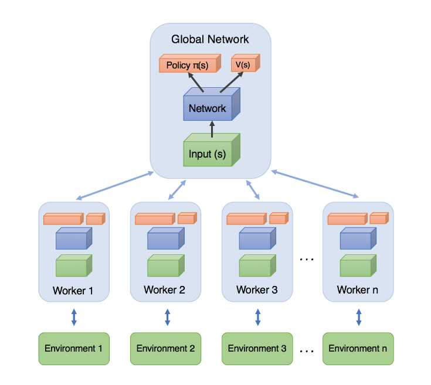
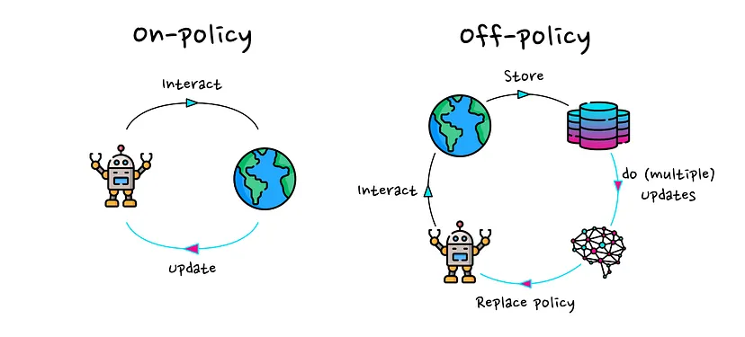

# Advanced Methods

## Introduction

Reinforcement Learning (RL) has significantly evolved with the development of **actor-critic methods**, which combine the benefits of policy-based and value-based approaches. These methods utilize **policy gradients** for optimizing the agent’s actions while employing a **critic network** to estimate value functions, leading to improved stability.

As we explored last week, key concepts like Reward-to-Go and Advantage Estimation lay the foundation for understanding and enhancing these methods. Building on that conversation, this document revisits these ideas, emphasizing their role in refining policy updates and stabilizing training.

In actor-critic methods, we explore key concepts that enhance learning efficiency:

- **Reward-to-Go**: A method for computing future. 
- **Advantage Estimation**: A technique to quantify how much better an action is compared to the expected return.  
- **Generalized Advantage Estimation (GAE)**: A framework that balances bias and variance in advantage computation, making training more stable.  

This document covers three widely used actor-critic algorithms:

- **Proximal Policy Optimization (PPO)**: A popular on-policy algorithm that stabilizes policy updates through a clipped objective function.  
- **Deep Deterministic Policy Gradient (DDPG)**: An off-policy algorithm designed for continuous action spaces, incorporating experience replay and target networks.  
- **Soft Actor-Critic (SAC)**: A state-of-the-art off-policy method that introduces entropy maximization to improve exploration and robustness.  

Each section delves into these algorithms, their theoretical foundations, and their practical advantages in reinforcement learning tasks.
  
---

#### Actor-Critic

The variance of policy methods can originate from two sources:

1. high variance in the cumulative reward estimate
2. high variance in the gradient estimate. 

For both problems, a solution has been developed: bootstrapping for better reward estimates and baseline subtraction to lower the variance of gradient estimates.

In the next seciton we will review the concepts bootstrapping (***reward to go***), using baseline (***Advantage value***) and ***Generalized Advantage Estimation*** (GAE).

##### Reward to Go:
***A cumulative reward from state $s_t$ to the end of the episode by applying policy $\pi_\theta$.***

As mentioned earlier, in the *policy gradient* method, we update our policy weights with the learning rate $\alpha$ as follows:

$$
\theta \leftarrow \theta + \alpha \nabla_\theta J(\theta),
$$

where

$$
\nabla_\theta J(\theta) \approx \frac{1}{N} \sum^N_{i=1} \sum^T_{t=1} \nabla_\theta \log\pi_\theta(a_{i,t}|s_{i,t})\cdot r(s_{i,t},a_{i,t}).
$$

In this equation, the term $r(s_{i,t}, a_{i,t})$ is the primary source of variance and noise. We use the *causality trick* to mitigate this issue by multiplying the policy gradient at state $s_t$ with its future rewards. It is important to note that the policy at state $s_t$ can only affect future rewards, not past ones. The causality trick is represented as follows:

$$
\nabla_\theta J(\theta) \approx \frac{1}{N} \sum^N_{i=1}\bigg( \sum^T_{t=1} \nabla_\theta \log\pi_\theta(a_{i,t}|s_{i,t})\bigg) \bigg( \sum^T_{t=1}r(s_{i,t},a_{i,t}) \bigg) \approx \frac{1}{N} \sum^N_{i=1} \sum^T_{t=1} \nabla_\theta \log\pi_\theta(a_{i,t}|s_{i,t})\bigg( \sum^T_{t'=t}r(s_{i,t'},a_{i,t'}) \bigg).
$$

The term $\sum^T_{t'=t}r(s_{i,t'},a_{i,t'})$ is known as ***reward to go***, which is calculated in a Monte Carlo manner. It represents the total expected reward from a given state by applying policy $\pi_\theta$, starting from time $t$ to the end of the episode.

To further reduce variance, we can approximate the *reward to go* with the *Q-value*, which conveys a similar meaning. Thus, we can rewrite $\nabla_\theta J(\theta)$ as:

$$
\nabla_\theta J(\theta) \approx \frac{1}{N} \sum^N_{i=1} \sum^T_{t=1} \nabla_\theta \log\pi_\theta(a_{i,t}|s_{i,t}) Q(s_{i,t},a_{i,t}).
$$

##### Advantage Value:
***Measures how much an action is better than the average of other actions in a given state.***

###### Why Use the Advantage Value?
We can further reduce variance by subtracting a baseline from $Q(s_{i,t}, a_{i,t})$ without altering the expectation of $\nabla_\theta J(\theta)$, making it an unbiased estimator:

$$
\nabla_\theta J(\theta) \approx \frac{1}{N} \sum^N_{i=1} \sum^T_{t=1} \nabla_\theta \log\pi_\theta(a_{i,t}|s_{i,t}) \bigg( Q(s_{i,t},a_{i,t}) - b_t \bigg).
$$

A reasonable choice for the baseline is the expected reward. Although it is not optimal, it significantly reduces variance.

We define:

$$
Q(s_{i,t},a_{i,t}) = \sum_{t'=t}^T E_{\pi_\theta}[r(s_{t'}, a_{t'})|s_t,a_t].
$$

To ensure the baseline is independent of the action taken, we compute the expectation of $Q(s_{i,t}, a_{i,t})$ over all actions sampled from the policy:

$$
E_{a_t \sim \pi_\theta(a_{i,t}|s_{i,t})} [Q(s_{i,t},a_{i,t})] = V(s_t) = b_t.
$$

Thus, the variance-reduced policy gradient equation becomes:

$$
\nabla_\theta J(\theta) \approx \frac{1}{N} \sum^N_{i=1} \sum^T_{t=1} \nabla_\theta \log\pi_\theta(a_{i,t}|s_{i,t}) \bigg( Q(s_{i,t},a_{i,t}) - V(s_t) \bigg).
$$

We define the *advantage function* as:

$$
A(s_t,a_t) = Q(s_{i,t},a_{i,t}) - V(s_t).
$$

!!! example "Example of Understanding the Advantage Function"

    Consider a penalty shootout game to illustrate the concept of the advantage function and Q-values in reinforcement learning.

    

    - **Game Setup**:
        1. *Goalie Strategy*:  A goalie always jumps to the right to block the shot.
        2. *Kicker Strategy*: A kicker can shoot either left or right with equal probability (0.5 each), defining the kicker's policy $\pi_k$.

    The reward matrix for the game is:

    | Kicker / Goalie | Right (jumps right) | Left (jumps left) |
    |:---:|:---:|:---:|
    | Right (shoots right)  | 0,1  | 1,0  |
    | Left (shoots left)    | 1,0  | 0,1  |

    - **Expected Reward**:
  
        Since the kicker selects left and right with equal probability, the expected reward is:

        $$
        V^{\pi_k}(s_t) = 0.5 \times 1 + 0.5 \times 0 = 0.5.
        $$

    - **Q-Value Calculation**:
        The Q-value is expressed as:

        $$
        Q^{\pi_k}(s_{i,t},a_{i,t}) = V^{\pi_k}(s_t) + A^{\pi_k}(s_t,a_t).
        $$

        - If the kicker shoots right, the shot is always saved ($Q^{\pi_k}(s_{i,t},r) = 0$).
        - If the kicker shoots left, the shot is always successful ($Q^{\pi_k}(s_{i,t},l) = 1$).

    - **Advantage Calculation**:

        The advantage function $A^{\pi_k}(s_t,a_t)$ measures how much better or worse an action is compared to the expected reward.

        - If the kicker shoots left, he scores (reward = 1), which is 0.5 more than the expected reward $V^{\pi_k}(s_t)$. Thus, the advantage of shooting left is:

        $$
        1 = 0.5 + A^{\pi_k}(s_t,l) \Rightarrow A^{\pi_k}(s_t,l) = 0.5.
        $$

        - If the kicker shoots right, he fails (reward = 0), which is 0.5 less than the expected reward. Thus, the advantage of shooting right is:

        $$
        0 = 0.5 + A^{\pi_k}(s_t,r) \Rightarrow A^{\pi_k}(s_t,r) = -0.5.
        $$

###### Estimating the Advantage Value

Instead of maintaining separate networks for estimating $V(s_t)$ and $Q(s_{i,t}, a_{i,t})$, we approximate $Q(s_{i,t}, a_{i,t})$ using $V(s_t)$:

$$
Q(s_{i,t},a_{i,t}) = r(s_t, a_t) + \sum_{t'=t+1}^T E_{\pi_\theta}[r(s_{t'}, a_{t'})|s_t,a_t] \approx r(s_t, a_t) + V(s_{t+1}).
$$

Thus, we estimate the advantage function as:

$$
A(s_{i,t},a_{i,t}) \approx r(s_t, a_t) + V(s_{t+1}) - V(s_t).
$$

We can also, consider the advantage function with discount factor as:

$$
A(s_{i,t},a_{i,t}) \approx r(s_t, a_t) + \gamma V(s_{t+1}) - V(s_t).
$$

To train the value estimator, we use Monte Carlo estimation.

##### Generalized Advantage Estimation (GAE)
To have a good  balance between variance and bias, we can use the concept of GAE, which is firstly introduced in [High-Dimensional Continuous Control Using Generalized Advantage Estimation](https://arxiv.org/abs/1506.02438). 

At the first, we define $\hat{A}^{(k)}(s_{i,t},a_{i,t})$ to understand this the GAE concept.

$$
\hat{A}^{(k)}(s_{i,t},a_{i,t}) = r(s_t, a_t) + \dots + \gamma^{k-1}r(s_{t+k-1}, a_{t+k-1}) + \gamma^k V(s_{t+k})- V(s_t).
$$

So, we can write the $\hat{A}^{(k)}(s_{i,t},a_{i,t})$ for $k \in \{1, \infty\}$ as:

$$
\hat{A}^{(1)}(s_{i,t},a_{i,t}) = r(s_t, a_t) + \gamma V(s_{t+1}) - V(s_t)
$$

$$
\hat{A}^{(2)}(s_{i,t},a_{i,t}) = r(s_t, a_t) + \gamma r(s_{t+1}, a_{t+1}) + \gamma^2 V(s_{t+2}) - V(s_t)
$$

$$
.\\
.\\
.\\
$$

$$
\hat{A}^{(\infty)}(s_{i,t},a_{i,t}) = r(s_t, a_t) + \gamma r(s_{t+1}, a_{t+1}) + \gamma^2 r(s_{t+2}, a_{t+2})+ \dots - V(s_t)\\
$$

$\hat{A}^{(1)}(s_{i,t},a_{i,t})$ is high bias, low variance, whilst $\hat{A}^{(\infty)}(s_{i,t},a_{i,t})$ is unbiased, high variance.

We take a weighted average of all $\hat{A}^{(k)}(s_{i,t},a_{i,t})$ for $k \in \{1, \infty\}$ with weight $w_k = \lambda^{k-1}$ to balance bias and variance. This is called Generalized Advantage Estimation (GAE). 

$$
\hat{A}^{(GAE)}(s_{i,t},a_{i,t}) = \frac{\sum_{k =1}^T  w_k \hat{A}^{(k)}(s_{i,t},a_{i,t})}{\sum_k w_k}= \frac{\sum_{k =1}^T \lambda^{k-1} \hat{A}^{(k)}(s_{i,t},a_{i,t})}{\sum_k w_k}
$$

##### Actor-Critic Algorihtms

###### Batch actor-critic algorithm
The first algorithm is *Actor-Critic with Bootstrapping and Baseline Subtraction*.
In this algorithm, the simulator runs for an entire episode before updating the policy.

**Batch actor-critic algorithm:**

1. **for** each episode **do**:
2. &emsp;**for** each step **do**:
3. &emsp;&emsp;Take action $a_t \sim \pi_{\theta}(a_t | s_t)$, get $(s_t,a_t,s'_t,r_t)$.
4. &emsp;Fit $\hat{V}(s_t)$ with sampled rewards.
5. &emsp;Evaluate the advantage function: $A({s_t, a_t})$
6. &emsp;Compute the policy gradient: $\nabla_{\theta} J(\theta) \approx \sum_{i} \nabla_{\theta} \log \pi_{\theta}(a_i | s_i) A({s_t})$
7. &emsp;Update the policy parameters:  $\theta \gets \theta + \alpha \nabla_{\theta} J(\theta)$
 

Running full episodes for a single update is inefficient as it requires a significant amount of time. To address this issue, the **online actor-critic algorithm** is proposed.

###### Online actor-critic algorithm

In this algorithm, we take an action in the environment and immediately apply an update using that action.

**Online actor-critic algorithm**

1. **for** each episode **do**:
2. &emsp;**for** each step **do**:
3. &emsp;&emsp;Take action $a_t \sim \pi_{\theta}(a_t | s_t)$, get $(s_t,a_t,s'_t,r_t)$.
2. &emsp;&emsp;Fit $\hat{V}(s_t)$ with the sampled reward.
3. &emsp;&emsp;Evaluate the advantage function: $A({s,a})$
4. &emsp;&emsp;Compute the policy gradient: $\nabla_{\theta} J(\theta) \approx  \nabla_{\theta} \log \pi_{\theta}(a | s) A({s,a})$
5. &emsp;&emsp;Update the policy parameters: $\theta \gets \theta + \alpha \nabla_{\theta} J(\theta)$

Training neural networks with a batch size of 1 leads to high variance, making the training process unstable.

To mitigate this issue, two main solutions are commonly used:

1. **Parallel Actor-Critic (Online)**
2. **Off-Policy Actor-Critic**

###### Parallel Actor-Critic (Online)
Many high-performance implementations are based on the actor critic approach. For large problems, the algorithm is typically parallelized and implemented on a large cluster computer.

To reduce variance, multiple actors are used to update the policy. There are two main approaches:

- **Synchronized Parallel Actor-Critic:** All actors run synchronously, and updates are applied simultaneously. However, this introduces synchronization overhead, making it impractical in many cases.
- **Asynchronous Parallel Actor-Critic:** Each actor applies its updates independently, reducing synchronization constraints and improving computational efficiency. It also, uses asynchronous (parallel and distributed) gradient descent for optimization of deep neural network controllers.

??? Tip "Resources & Links"
    
    [Asynchronous Methods for Deep Reinforcement Learning](https://arxiv.org/abs/1602.01783)

    [Actor-Critic Methods: A3C and A2C](https://danieltakeshi.github.io/2018/06/28/a2c-a3c/)

    [The idea behind Actor-Critics and how A2C and A3C improve them](https://theaisummer.com/Actor_critics/)

###### Off-Policy Actor-Critic Algorithm

In the off-policy approach, we maintain a replay buffer to store past experiences, allowing us to train the model using previously collected data rather than relying solely on the most recent experience.

**Off-policy actor-critic algorithm:**

1. **for** each episode **do**:
2. &emsp;**for** multiple steps **do**:
3. &emsp;&emsp;Take action $a \sim \pi_{\theta}(a | s)$, get $(s,a,s',r)$, store in $\mathcal{R}$.
4. &emsp;Sample a batch $\{s_i, a_i, r_i, s'_i \}$ for buffer $\mathcal{R}$.
5. &emsp;Fit $\hat{Q}^{\pi}(s_i, a_i)$ for each $s_i, a_i$.
6. &emsp;Compute the policy gradient: $\nabla_{\theta} J(\theta) \approx \frac{1}{N} \sum_{i} \nabla_{\theta} \log \pi_{\theta}(a^{\pi}_i | s_i) \hat{Q}^{\pi}(s_i, a^{\pi}_i)$
7. &emsp;Update the policy parameters: $\theta \gets \theta + \alpha \nabla_{\theta} J(\theta)$

To work with off-policy methods, we use the Q-value instead of the V-value in step 3. In step 4, rather than using the advantage function, we directly use $\hat{Q}^{\pi}(s_i, a^{\pi}_i)$, where $a^{\pi}_i$  is sampled from the policy $\pi$. By using the Q-value instead of the advantage function, we do not encounter the high-variance problem typically associated with single-step updates. This is because we sample a batch from the replay buffer, which inherently reduces variance. As a result, there is no need to compute an explicit advantage function for variance reduction.

##### Issues with Standard Policy Gradient Methods
Earlier policy gradient methods, such as Vanilla Policy Gradient (VPG) or REINFORCE, suffer from high variance and instability in training. A key problem is that large updates to the policy can lead to drastic performance degradation.

To address these issues, Trust Region Policy Optimization (TRPO) was introduced, enforcing a constraint on how much the policy can change in a single update. However, TRPO is computationally expensive because it requires solving a constrained optimization problem.
PPO is a simpler and more efficient alternative to TRPO, designed to ensure stable policy updates without requiring complex constraints.

---