# Week 5: Model-Based Methods

!!! note
    This document merges **Lectures 9 and 10** from Prof. Mohammad Hossein Rohban's DRL course, **Lecture 9: Model-Based RL** slides from Prof. Sergey Levine’s CS 294-112 (Deep RL) with a **more rigorous, survey-based structure** drawing on Moerland et al. (2022). We provide intuitions, mathematical details, and references to relevant works.


## 1. Introduction & Scope

Model-Based Reinforcement Learning (MBRL) combines **planning** (using a model of environment dynamics) and **learning** (to approximate value functions or policies globally). MBRL benefits from being able to reason about environment dynamics “in imagination,” thus often achieving higher sample efficiency than purely model-free RL. However, ensuring accurate models and mitigating compounding errors pose key challenges.


We address:

1. The **MDP** framework and definitions.  
2. **Model learning**: from basic supervised regression to advanced methods handling stochasticity, uncertainty, partial observability, etc.  
3. **Integrating planning**: how to incorporate planning loops, short vs. long horizons, and real-world data interplay.  
4. **Modern MBRL** algorithms (World Models, PETS, MBPO, Dreamer, MuZero).  
5. **Benefits and drawbacks** of MBRL.

---

## 2. Markov Decision Processes

We adopt the standard **Markov Decision Process (MDP)** formulation [Puterman, 2014]:

\[
\mathcal{M} = \bigl(\mathcal{S}, \mathcal{A}, P, R, p(s_0), \gamma\bigr),
\]

where:
- \(\mathcal{S}\) is the (possibly high-dimensional) state space.  
- \(\mathcal{A}\) is the action space (can be discrete or continuous).  
- \(P(s_{t+1}\mid s_t,a_t)\) is the transition distribution.  
- \(R(s_t,a_t,s_{t+1})\) is the reward function.  
- \(p(s_0)\) is the initial-state distribution.  
- \(\gamma \in [0,1]\) is the discount factor.

A **policy** \(\pi(a \mid s)\) dictates which action to choose at each state. The **value function** and **action-value function** are:

\[
V^\pi(s) \;=\; \mathbb{E}\Bigl[\sum_{k=0}^\infty \gamma^k r_{t+k}\;\big|\;s_t = s,\;\pi\Bigr],
\]

\[
Q^\pi(s,a) \;=\; \mathbb{E}\Bigl[\sum_{k=0}^\infty \gamma^k r_{t+k}\;\big|\;s_t = s,\,a_t = a,\;\pi\Bigr].
\]

We want to find \(\pi^\star\) that maximizes expected return. **Model-Based RL** obtains a **model** of the environment’s dynamics \( \hat{P}, \hat{R}\), then uses **planning** with that model (e.g., rollouts, search) to aid in learning or acting.

---

## 3. Categories of Model-Based RL

Following Moerland et al., we distinguish:

1. **Planning** (known model, local solutions).  
2. **Model-Free RL** (no explicit model, but learns a global policy or value).  
3. **Model-Based RL** (learned or known model **and** a global policy/value solution).

**Model-Based RL** itself splits into two key variants:

- **Model-based RL with a *known* model**: E.g., AlphaZero uses perfect board-game rules.  
- **Model-based RL with a *learned* model**: E.g., Dyna, MBPO, Dreamer, where the agent must learn \(\hat{P}(s_{t+1}\mid s_t,a_t)\).

In addition, one could do **planning over a learned model** but never store a global policy or value (just do local search each time)—that’s still “planning + learning,” but not strictly “model-based RL” if no global policy is learned in the end .

---

## 4. Basic Schemes

References present high-level approaches, sometimes referred to as:

- **Version 0.5**: Collect random samples once, fit a model, do single-shot planning. Risks severe distribution mismatch.  
- **Version 1.0**: Iterative approach (collect data, re-fit model, plan). Improves coverage, but naive open-loop plans can fail.  
- **Version 1.5**: **Model Predictive Control (MPC)**: replan at each step or on short horizons – more robust but computationally heavier.  
- **Version 2.0**: **Backprop through the learned model** directly into the policy – can be efficient at runtime, but numerically unstable for complex or stochastic tasks.


### Version 0.5: Single-Shot Model + Planning

1. **Data Collection (Random / Fixed Exploration):**  
   - You collect a dataset of (state, action, next-state, reward) tuples from the environment, usually by acting randomly or following some simple predefined strategy.  
   - You do this once and **do not** gather any more data after the initial collection phase.

2. **Model Learning (One-Time Fit):**  
   - You take that static dataset and train a model \( p_\theta(s' \mid s, a) \) that predicts the next state \(s'\) (and possibly the reward \( r \)) from the current state \(s\) and action \(a\).  
   - Since this is done only once, the model may have limited coverage if the initial dataset doesn’t span enough of the state–action space.

3. **Planning or Policy Optimization (Single-Shot):**  
   - You use the learned model for **open-loop** planning. For example, you might do a tree search (if the state/action space is small enough) or run some trajectory optimization from the model.  
   - Crucially, this planning or optimization is performed **only once**. Once you finalize a plan or policy, you do not replan.

4. **Risks and Issues – Distribution Mismatch:**  
   - The biggest pitfall: your model is only accurate on the data distribution you used to train it. If, during execution of your plan, you visit states **outside** that distribution, the model’s predictions can be wildly wrong (extrapolation errors).  
   - This leads to the “compounding errors” problem: small prediction mistakes early on cause the agent to stray into unseen states, leading to bigger and bigger errors.  
   - Since you never collect new data to correct the model, you risk catastrophic failure in real interaction.

**Summary**: Version 0.5 is a naive approach—fit once, plan once. It’s conceptually simplest, but vulnerable to distribution mismatch and is usually only practical in very controlled domains or with very large, comprehensive datasets.

---

### Version 1.0: Iterative Re-Fitting + Planning

1. **Iterative Data Collection:**  
   - Instead of gathering a fixed dataset once, you iteratively interact with the environment using your current policy (or a planning procedure) to collect new data.  
   - After you act in the environment for some time, you aggregate the new transitions into your dataset.

2. **Re-Fit the Model:**  
   - Every time you collect more (state, action, next-state, reward) samples, you update (retrain or refine) your dynamics model \( p_\theta(s' \mid s, a) \).  
   - This constant re-fitting ensures the model can gradually expand its knowledge over states that your policy actually visits.

3. **Re-Plan with Updated Model:**  
   - After improving the model, you re-run your planning or policy-optimization routine to update your policy in light of the new, presumably more accurate, model.  
   - This means the agent’s behavior changes and may visit new or more challenging states, leading to further improvements when you collect even more data.

4. **Open-Loop Planning Pitfalls:**  
   - Although the model is updated iteratively, **each plan** is typically computed “open-loop” and then executed.  
   - In an environment with stochastic transitions or model errors, open-loop trajectories can deviate rapidly from the plan. You only get a chance to correct for that deviation in the **next** iteration of data collection.  
   - This approach can still suffer if the planning horizon is long and the model is imperfect over that horizon.

**Summary**: Version 1.0 improves on 0.5 by iteratively updating the model with fresh data. While it mitigates (but does not completely solve) distribution mismatch, it can still fail if “open-loop” plans deviate significantly from reality between each re-planning phase.

---

### Version 1.5: Model Predictive Control (MPC)

1. **Short-Horizon Re-Planning at Each Step:**  
   - Instead of planning once per data-collection phase, MPC re-plans **every step** (or at frequent short horizons). In effect, at each time \(t\), you:  
     1. Take your current state \( s_t \).  
     2. Plan a short sequence of actions \(\{a_t, \dots, a_{t+H-1}\}\) by using the learned model.  
     3. Execute only the **first** action \(a_t\).  
     4. Observe the next real state \(s_{t+1}\).  
     5. **Re-plan** from \( s_{t+1} \).  
   - This repeated “plan one step, move, re-plan” yields **closed-loop** control.

2. **More Robust to Model Error:**  
   - By re-planning so frequently, the agent reduces compounding errors from modeling mistakes or environmental stochasticity.  
   - Each step, the agent can correct its trajectory based on the **actual** observed state, which helps if the model wasn’t perfectly accurate in predicting the next state.

3. **Computational Considerations:**  
   - MPC can be computationally heavy because you perform a planning or optimization loop at **every** time step (or at least very frequently).  
   - This might be feasible for lower-dimensional systems or if you have a very efficient planner, but it can become a bottleneck in higher-dimensional or time-critical tasks.

4. **Data Efficiency and Safety:**  
   - MPC often collects data while also controlling the system in a relatively stable way, which can lead to safer or smoother training in real-world scenarios.  
   - Each re-planning step effectively “stays within” the region of the state space where the model is more accurate, because any large deviation leads to immediate re-planning.

**Summary**: Version 1.5 (MPC) is a more **closed-loop** approach to model-based control. It’s often more robust than naive iterative planning, but requires significant repeated computation. It is popular in systems where real-time re-planning is possible and where it is crucial to correct for small modeling errors on the fly.

---

### Version 2.0: Backprop Through the Model into the Policy

1.**Differentiable Model:**  
   - You assume (or construct) a **differentiable** learned model \( p_\theta(s' \mid s, a) \). In practice, this is often a neural network that predicts next states (and rewards).  
   - Because the model is differentiable, you can do **gradient-based** optimization of the policy parameters \( \phi \) (for a parametric policy \(\pi_\phi(a \mid s)\)) through the model’s predictions of future states and rewards.

2.**End-to-End Policy Optimization:**  
   - Instead of planning explicitly with a tree search or repeated rollouts, you write down a differentiable objective (e.g., predicted cumulative reward) and differentiate that objective w.r.t. policy parameters.  
   - Mathematically, you do something like:  

$$
J(\phi) = \mathbb{E}_{\tau \sim \pi_\phi, p_\theta} \big[ \sum_{t=0}^T r(s_t, a_t) \big],
$$

   where \(\tau = (s_0, a_0, s_1, \dots)\) is a trajectory generated by \(\pi_\phi\) **through** the learned dynamics \(p_\theta\).  
   - By **backpropagating** through the unrolled trajectory, you get direct gradients that shape \(\phi\).

3.**Efficiency at Inference Time:**  
   - Once trained, this approach yields a policy \(\pi_\phi\) that can be executed **instantly** at runtime: you just feed the current state \(s_t\) into the policy network and sample or pick an action.  
   - You do **not** need full-blown re-planning each step, so it is often much cheaper at execution time than MPC.

4.**Challenges – Numerical Instability & Stochasticity:**  
   - Unrolling many time steps through a learned neural model can lead to exploding or vanishing gradients. The further into the future you unroll, the harder it can be to keep gradients stable.  
   - If the environment is very stochastic or if the model has high uncertainty, the backprop-based approach can overfit to spurious aspects of the learned model—leading to poor real-world performance.  
   - Proper regularization, uncertainty estimation, or shorter-horizon rollouts can mitigate these issues but still require delicate tuning.

**Summary**: Version 2.0 leverages a **differentiable model** to directly optimize policy parameters end-to-end, which is more “elegant” and can be highly efficient at execution time. However, it can be numerically tricky—especially for long horizons or noisy tasks—and may require careful model design and regularization.

---

## 5. Dynamics Model Learning

Learning a model \(\hat{P}(s_{t+1}\mid s_t,a_t)\) + \(\hat{R}(s_t,a_t)\) is often done via **supervised learning** on transitions \((s_t,a_t,s_{t+1},r_t)\). This section surveys advanced considerations from Moerland et al. .

### 5.1 Basic Considerations

1. **Type of Model**  
   - **Forward** (most common): \((s_t,a_t)\mapsto s_{t+1}\).  
   - **Backward** (reverse model): \(s_{t+1}\mapsto (s_t,a_t)\). Used in prioritized sweeping.  
   - **Inverse**: \((s_t, s_{t+1}) \mapsto a_t\). Sometimes used in representation learning or feedback control.

2. **Estimation Method**  
   - **Parametric** (e.g., neural networks, linear regressors, GPs).  
   - **Non-parametric** (e.g., nearest neighbors, kernel methods).  
   - **Exact** (tabular) vs. **approximate** (function approximation).

3. **Region of Validity**  
   - **Global** model: Attempt to capture all states. Common in large-scale MBRL.  
   - **Local** model: Fit only around the current trajectory or region of interest (common in robotics, e.g., local linearization).

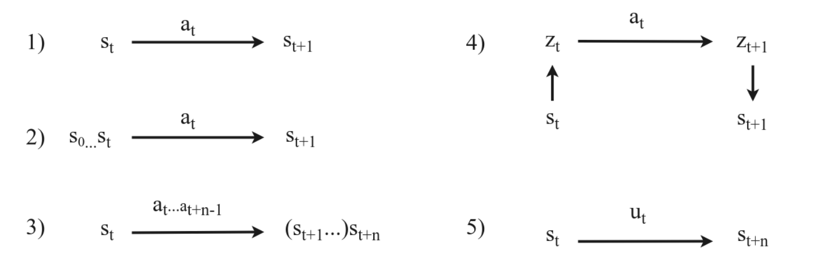
***Overview of different types of mappings in model learning.** **1)** Standard Markovian transition model \( s_t, a_t \rightarrow s_{t+1} \). **2)** Partial observability. We model \( s_0 \ldots s_t, a_t \rightarrow s_{t+1} \), leveraging the state history to make an accurate prediction. **3)** Multi-step prediction (Section 4.6), where we model \( s_t, a_t \ldots a_{t+n-1} \rightarrow s_{t+n} \), to predict the \( n \) step effect of a sequence of actions. **4)** State abstraction, where we compress the state into a compact representation \( z_t \) and model the transition in this latent space. **5)** Temporal/action abstraction, better known as hierarchical reinforcement learning, where we learn an abstract action \( u_t \) that brings us to \( s_{t+n} \). Temporal abstraction directly implies multi-step prediction, as otherwise the abstract action \( u_t \) is equal to the low level action \( a_t \). All the above ideas (**2–5**) are orthogonal and can be combined.*

---

### 5.2 Stochasticity

Real MDPs can be **stochastic**, i.e. \(P(s_{t+1}\mid s_t,a_t)\) is a distribution. A purely deterministic network trained with MSE might collapse to the **conditional mean**:

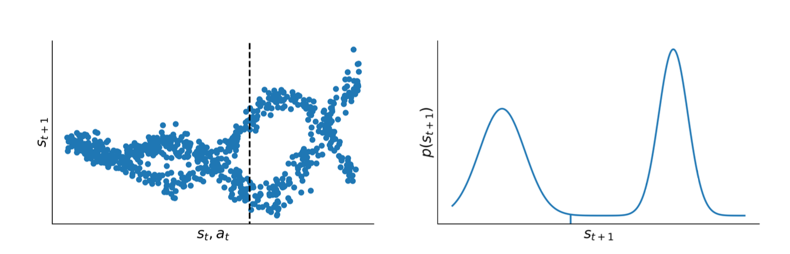
*Illustration of stochastic transition dynamics. **Left**: 500 samples from an example transition function \(P(s_{t+1} \mid s, a)\). The vertical dashed line indicates the cross-section distribution on the right. **Right**: distribution of \(s_{t+1}\) for a particular \(s, a\). We observe a multimodal distribution. The conditional mean of this distribution, which would be predicted by mean squared error (MSE) training, is shown as a vertical line.*


To properly capture multi-modal transitions:

- **Descriptive (distribution) models**: E.g. Gaussian Mixtures or discrete tabular distributions.  
- **Generative approaches**: Neural networks that sample from a latent distribution, e.g. **variational autoencoders**, **normalizing flows**, or **GANs** adapted for sequences (video prediction).

Mathematically, a generative approach might parametrize:

\[
s_{t+1} \sim \mathcal{N}\bigl(\mu_\theta(s_t,a_t),\,\Sigma_\theta(s_t,a_t)\bigr),
\]

where \(\theta\) is learned by maximizing log-likelihood or via variational inference.

---

### 5.3 Uncertainty

A critical challenge in MBRL is **model uncertainty**—the model is learned from limited data, so predictions can be unreliable in unfamiliar state-action regions. We distinguish:

- **Aleatoric (intrinsic) uncertainty**: inherent stochasticity in transitions.  
- **Epistemic (model) uncertainty**: arises from limited training data. This can, in principle, be reduced by gathering more data.

A rigorous approach is to **maintain a distribution over possible models**, then plan by integrating or sampling from that distribution to avoid catastrophic exploitation of untrusted model regions.

#### Bayesian Neural Networks

One approach is a **Bayesian neural network (BNN)**:

\[
\theta \sim p(\theta), \quad s_{t+1} \sim P_\theta(\cdot \mid s_t, a_t).
\]

We keep a posterior \(p(\theta\mid D)\) over network weights \(\theta\) given dataset \(D\). Predictive distribution for the next state is then:

\[
p(s_{t+1}\mid s_t,a_t, D) = \int P_\theta(s_{t+1}\mid s_t,a_t)\,p(\theta\mid D)\,d\theta.
\]

In practice, approximations like **variational dropout** or **Laplace approximation** are used to sample from \(p(\theta)\).

#### Ensembles and Bootstrapping

Another popular method is an **ensemble** of \(N\) models \(\{\hat{P}_{\theta_i}\}\). Each model is trained on a bootstrapped subset of the data (or with different initialization seeds). The variance across predictions:

\[
\mathrm{Var}\bigl[\hat{P}_{\theta_i}(s_{t+1}\mid s_t,a_t)\bigr]
\]

indicates **epistemic** uncertainty. In practice:

\[
\hat{\mu}_\mathrm{ensemble}(s_{t+1}) \approx \frac{1}{N}\sum_{i=1}^N \hat{\mu}_i(s_{t+1}),
\quad
\hat{\Sigma}_\mathrm{ensemble}(s_{t+1}) \approx \frac{1}{N}\sum_{i=1}^N \bigl(\hat{\mu}_i - \hat{\mu}_\mathrm{ensemble}\bigr)^2.
\]

During planning, one may:

1. Sample one model from the ensemble at each step (like **PETS**).
2. Average the predictions or treat it as a Gaussian mixture model.

Either way, uncertain regions typically manifest as a large disagreement among ensemble members, warning the planner not to trust that zone.

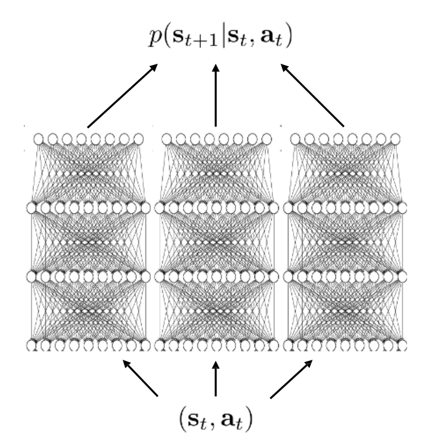

**Mathematically**: if the “true” dynamics distribution is \(P^\star\) and each model \(\hat{P}_{\theta_i}\) is an unbiased estimator, then large variance across \(\{\hat{P}_{\theta_i}\}\) signals a region outside the training distribution. Minimizing that variance can guide exploration or help shape conservative planning.

---

### 5.4 Partial Observability

Sometimes the environment is not fully observable. We can’t identify the full state \(s\) from a single observation \(o\). Solutions:

- **Windowing**: Keep last \(n\) observations \((o_t, o_{t-1}, \dots)\).  
- **Belief state**: Use a hidden Markov model or Bayesian filter.  
- **Recurrence**: Use RNNs/LSTMs that carry hidden state \(\mathbf{h}_t\).  
- **External Memory**: Neural Turing Machines, etc., for long-range dependencies.

---

### 5.5 Non-Stationarity

**Non-stationary** dynamics means that \(P\) or \(R\) changes over time. A single learned model can become stale. Approaches include:

- **Partial models** [Doya et al., 2002]: Maintain multiple submodels for different regimes, detect changes in transition error.  
- **High learning-rate** or **forgetting** older data to adapt quickly.

---

### 5.6 Multi-Step Prediction

One-step predictions can accumulate error when rolled out repeatedly. Some solutions:

- **Train for multi-step**: Unroll predictions for \(k\) steps and backprop against ground truth \((s_{t+k})\).  
- **Dedicated multi-step models**: Instead of chaining one-step predictions, learn \(f^{(k)}(s_t,a_{t:k-1})\approx s_{t+k}\).

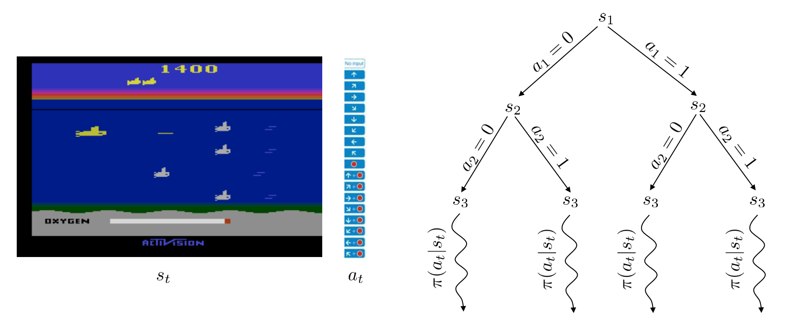

---

### 5.7 State Abstraction

**Representation learning**: Instead of modeling raw \((s,a)\mapsto s'\) in high dimension, we learn a latent \(\mathbf{z} = f_{\text{enc}}(s)\), predict \(\mathbf{z}'\) with a latent transition, then decode if needed. E.g.:

\[
\mathbf{z}_t = f_{\text{enc}}(s_t), \quad
\mathbf{z}_{t+1} = f_{\text{trans}}(\mathbf{z}_t,a_t), \quad
s_{t+1} = f_{\text{dec}}(\mathbf{z}_{t+1}).
\]

Techniques:
- **Autoencoders**, **VAE** for representation.  
- **Object-based** approaches (Graph NNs) when environment decomposes into discrete objects [Battaglia et al., 2016].  
- **Contrastive losses** to emphasize controllable or semantically relevant features [Sermanet et al., 2018; Ghosh et al., 2018].

---

### 5.8 Temporal Abstraction

**Hierarchical RL**: Instead of atomic actions, define “macro-actions” spanning multiple steps. E.g.:

- **Options** [Sutton et al., 1999]: Each option \(\omega\) has a subpolicy \(\pi_\omega\), an initiation set, and a termination condition.  
- **Goal-conditioned polices** (Feudal RL, Universal Value Functions).  
- **Subgoal discovery**: identify key states or “bottlenecks” to break down tasks [Menache et al., 2002].

Such abstractions can drastically reduce planning depth and improve data efficiency.

---

## 6. Integration of Planning and Learning

With a learned model in hand (or a known one), we combine **planning** and **learning** to optimize a policy \(\pi\). We address four major questions:

1. **Which state to start planning from?**  
2. **Budget and frequency**: how many real steps vs. planning steps?  
3. **Planning algorithm**: forward search, MCTS, gradient-based, etc.  
4. **Integration**: how planning outputs feed into policy/value updates and final action selection.

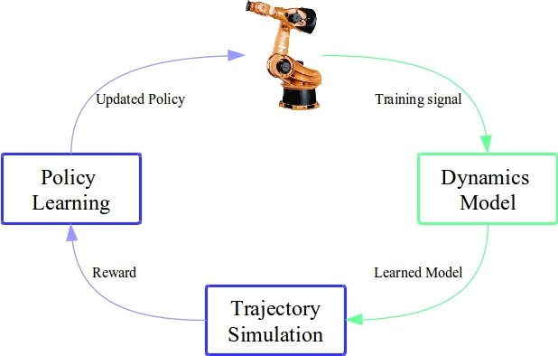

---

### 6.1 Which State to Start Planning From?

- **Uniform** over all states (like classical dynamic programming).  
- **Visited** states only (like Dyna [Sutton, 1990], which samples from replay).  
- **Prioritized** (Prioritized Sweeping [Moore & Atkeson, 1993]) if some states need urgent update.  
- **Current** state only (common in online MPC or MCTS from the real agent’s state).

---

### 6.2 Planning Budget vs. Real Data Collection

Two sub-questions:

1. **Frequency**: plan after every environment step, or collect entire episodes first?  
   - Dyna plans after each step (like 100 imaginary updates per real step).  
   - PILCO [Deisenroth & Rasmussen, 2011] fits a GP model after each episode.

2. **Budget**: how many model rollouts or expansions per planning cycle?  
   - Dyna might do 100 short rollouts.  
   - AlphaZero expands a single MCTS iteration by up to 1600 × depth calls.

Some methods adaptively adjust planning vs. real data based on model uncertainty [Kalweit & Boedecker, 2017]. The right ratio can significantly affect performance.

---

### 6.3 How to Plan? (Planning Algorithms)

Broadly:

1. **Discrete** (non-differentiable) search:
   - **One-step** lookahead  
   - **Tree search** (MCTS, minimax)  
   - **Forward vs. backward**: e.g., prioritized sweeping uses a reverse model to propagate value changes quickly

2. **Differential** (gradient-based) planning:
   - Requires a differentiable model \(\hat{P}\).  
   - E.g., iterative LQR, or direct backprop through unrolled transitions (Dreamer).  
   - Suited for continuous control with smooth dynamics.

3. **Depth & Breadth** choices:
   - Some do short-horizon expansions (MBPO uses 1–5 step imaginary rollouts).  
   - Others do deeper expansions if computing resources allow (AlphaZero MCTS).

4. **Uncertainty handling**:
   - Plan only near states with low model uncertainty or penalize uncertain states.  
   - Ensemble-based expansions [Chua et al., 2018].

!!! example "Cross-Entropy Method (CEM) – Pseudocode"
    ```python
    # Suppose we want to find the best action sequence of length H
    # that maximizes the expected return under our model.

    Initialize distribution params (mean mu, covariance Sigma)
    for iteration in range(N_iterations):
        # 1. Sample K sequences from current distribution
        candidate_sequences = sample_from_gaussian(mu, Sigma, K)

        # 2. Evaluate each sequence's return
        returns = []
        for seq in candidate_sequences:
            returns.append( evaluate_return(seq, model) )

        # 3. Select the top M (elite) sequences
        elite_indices = top_indices(returns, M)
        elites = [candidate_sequences[i] for i in elite_indices]

        # 4. Update mu, Sigma to fit the elites
        mu = mean(elites)
        Sigma = cov(elites)

    # Final distribution reflects the best action sequence
    best_action_seq = mu
    return best_action_seq
    ```

---

#### 6.3.1 Monte Carlo Tree Search (MCTS)

**Monte Carlo Tree Search** is a powerful method for **discrete action** planning—famously used in AlphaGo, AlphaZero, MuZero. Key components:

1.**Tree Representation**  
   
   - Each node is a state, edges correspond to actions.  
   - MCTS incrementally expands the search tree from a **root** (the current state).

2.**Four Steps** commonly described as:

   1.**Selection**: Repeatedly choose child nodes (actions) from the root, typically via **Upper Confidence Bound** or policy heuristics, until reaching a leaf node.  
   2.**Expansion**: If the leaf is not terminal (or at max depth), add one or more child nodes for possible next actions.  
   3.**Simulation**: From that new node, simulate a **rollout** (random or policy-driven) until reaching a terminal state or horizon.  
   4.**Backpropagation**: Propagate the **return** from the simulation up the tree to update value/statistics at each node.

3.**Mathematical Form**

   - Let \(N(s,a)\) be the number of visits to child action \(a\) from state \(s\).  
   - Let \(\hat{Q}(s,a)\) be the estimated action-value from MCTS.  
   - UCB selection uses:

\[
a_\text{select} = \arg\max_{a}\Bigl[\hat{Q}(s,a) + c \sqrt{\frac{\ln \sum_{b} N(s,b)}{N(s,a)}}\Bigr].
\]

(One can also incorporate a learned prior policy \(\pi_\theta\) to bias exploration.)

4. **Planning & Policy Extraction**  
   - After many simulations from the root, MCTS typically normalizes node visits or Q-values to produce a final policy distribution \(\alpha\).  
   - This policy \(\alpha\) may be used for real action selection, or to train a global policy network (as in AlphaZero).

!!! info "MCTS Pseudocode"
    ```vbnet
    MCTS(root_state, model, N_simulations)
    Initialize the search tree with root_state

    for simulation in 1 to N_simulations do
        node ← root of the tree

        # Selection
        while node is fully expanded and node is not terminal do
            action ← select child of node using UCB
            node ← child corresponding to action

        # Expansion
        if node is not terminal then
            expand node using model (generate all children)
            node ← select one of the new children

        # Simulation
        reward ← simulate from node.state using model

        # Backpropagation
        backpropagate reward up the tree from node

    # Final decision
    Return action from root with highest visit count
    ```
  
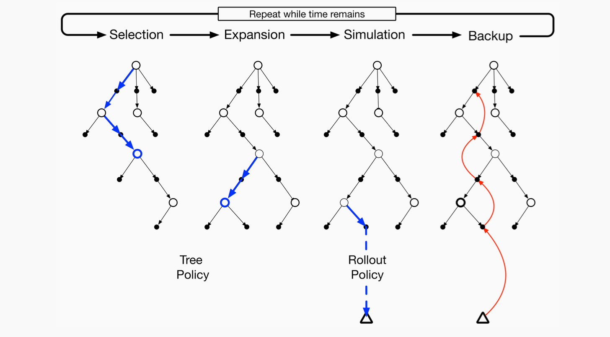

---

### 6.4 Integration in the Learning and Acting Loop

**Key integration channels**:

1.**Planning input** from existing policy/value?  
   - E.g., MCTS uses a prior policy to guide expansions.

2.**Planning output** as a **training target** for the global policy/value?  
   - E.g., **Dyna** uses imaginary transitions to update Q-values.  
   - **AlphaZero** uses MCTS results as a learning target for \(\pi\) and \(V\).

3.**Action selection** from the planning procedure or from the learned policy?
   - E.g., MPC picks the best action from a planned sequence.  
   - Or a final learned policy is used if no real-time planning is feasible.

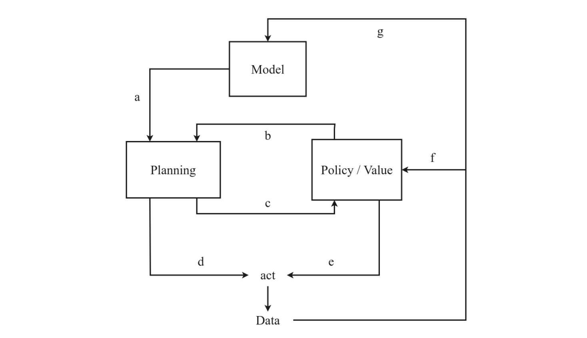

Various combinations exist: some methods rely mostly on the learned policy but refine or correct it with a short replan (MBPO), while others do a full MCTS at every step (MuZero).

---

### 6.5 Dyna and Dyna-Style Methods

One of the earliest and most influential frameworks for **model-based RL** is **Dyna** [Sutton, 1990]. The key insight is to integrate:

- **Real experience** from the environment (sampled transitions)  
- **Model learning** from that real data  
- **Imagined experience** from the learned model to augment the policy/value updates.

#### Dyna Pseudocode

```vbnet
Input: α (learning rate), γ (discount factor), ε (exploration rate), 
       n (number of planning steps), num_episodes

Initialize Q(s, a) arbitrarily for all states s ∈ S, actions a ∈ A
Initialize Model as an empty mapping: Model(s, a) → (r, s')

for each episode do
    Initialize state s ← starting state

    while s is not terminal do
        ▸ Action Selection (ε-greedy)
        With probability ε: choose random action a
        Else: choose a ← argmax_a Q(s, a)

        ▸ Real Interaction
        Take action a, observe reward r and next state s'

        ▸ Q-Learning Update
        Q(s, a) ← Q(s, a) + α [ r + γ · max_a' Q(s', a') − Q(s, a) ]

        ▸ Model Update
        Model(s, a) ← (r, s')

        ▸ Planning (n simulated updates)
        for i = 1 to n do
            Randomly select previously seen (ŝ, â)
            (r̂, ŝ') ← Model(ŝ, â)

            Q(ŝ, â) ← Q(ŝ, â) + α [ r̂ + γ · max_a' Q(ŝ', a') − Q(ŝ, â) ]

        ▸ Move to next real state
        s ← s'


```

1. **Real Interaction**: We pick action \(a\) in state \(s\) using \(\epsilon\)-greedy w.r.t. \(Q\).  
2. **Update Q** from real transition \((s,a,s',r)\).  
3. **Update Model**: store or learn to predict \(\hat{P}(s'\mid s,a)\), \(\hat{R}(s,a)\).  
4. **Imagination (N_planning steps)**: randomly sample a state-action pair from replay or memory, query the model for \(\hat{s}', \hat{r}\). Update \(Q\) with that synthetic transition.

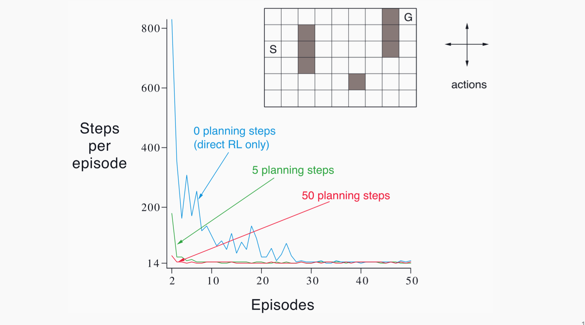


**Benefits**:  
- Dyna can drastically reduce real environment interactions by effectively **replaying** or generating new transitions from the learned model.  
- Even short rollouts or repeated “one-step planning” from random visited states helps refine Q-values more quickly.

**Dyna-Style** in modern deep RL:  
- Many algorithms (e.g., **MBPO**) add short-horizon imaginary transitions to an off-policy buffer.  
- They differ in details: how many model steps, how they sample states for imagination, how they manage uncertainty, etc.

---

## 7. Modern Model-Based RL Algorithms

Modern model-based RL builds on classical ideas (global/local models, MPC, iterative re-fitting) but incorporates powerful neural representations, uncertainty handling, and integrated planning-learning frameworks. Below are five influential algorithms that illustrate the **state of the art** in contemporary MBRL.

---

### 7.1 World Models (Ha & Schmidhuber, 2018)

**Core Idea**  
Train a **latent generative model** of the environment (specifically from high-dimensional inputs like images), and then learn or optimize a policy entirely **within this learned latent space**—the so-called “dream environment.”

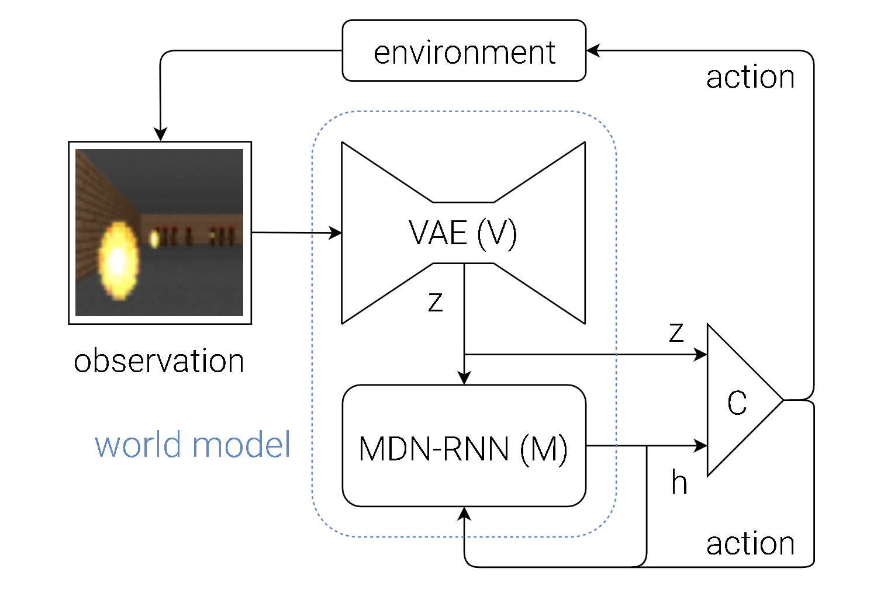

**Key Components**  
1.**Variational Autoencoder (VAE)**:  
   - Maps raw observation \(\mathbf{o}_t\) to a compact latent representation \(\mathbf{z}_t\).  
   - \(\mathbf{z}_t = E_\phi(\mathbf{o}_t)\) where \(E_\phi\) is the learned encoder.  
   - Reconstruction loss ensures \(E_\phi\) and a corresponding decoder \(D_\phi\) compress and reconstruct images effectively.

2.**Recurrent Dynamics Model (MDN-RNN)**:  
   - Predicts the next latent \(\mathbf{z}_{t+1}\) given \(\mathbf{z}_t\) and action \(a_t\).  
   - Often parameterized as a **Mixture Density Network** inside an RNN:  
     
$$
\mathbf{z}_{t+1} \sim p_\theta(\mathbf{z}_{t+1} \mid \mathbf{z}_t, a_t).
$$

   - This distribution can be modeled by a mixture of Gaussians, providing a probabilistic estimate of the next latent state.

3.**Controller (Policy)**:  
   - A small neural network \(\pi_\eta\) that outputs actions \(a_t = \pi_\eta(\mathbf{z}_t)\) in the latent space.  
   - Trained (in the original paper) via an evolutionary strategy (e.g., CMA-ES) *entirely in the dream world*.  

**Algorithmic Flow**  
1. **Unsupervised Phase**: Run a random or exploratory policy in the real environment, collect observations \(\mathbf{o}_1, \mathbf{o}_2, ...\).  
2. **Train the VAE** to learn \(\mathbf{z} = E_\phi(\mathbf{o})\).  
3. **Train the MDN-RNN** on sequences \((\mathbf{z}_t, a_t, \mathbf{z}_{t+1})\).  
4. **“Dream”**: Roll out the MDN-RNN from random latents and evaluate candidate controllers \(\pi_\eta\).  
5. **Update \(\pi_\eta\)** based on the dream performance (e.g., via evolutionary search).

**Significance**  
- Demonstrated that an agent can learn a **world model** of high-dimensional environments (CarRacing, VizDoom) and train policies in “latent imagination.”  
- Paved the way for subsequent latent-space MBRL (PlaNet, Dreamer).

---

### 7.2 PETS (Chua et al., 2018)

**Core Idea**  
**P**robabilistic **E**nsembles with **T**rajectory **S**ampling (PETS) uses **ensemble** neural network dynamics models to capture epistemic uncertainty, combined with **sampling-based planning** (like the Cross-Entropy Method, CEM) for continuous control.

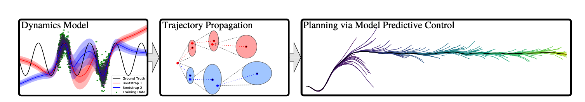

**Modeling Uncertainty**  
- Train \(N\) distinct neural networks \(\{\hat{P}_{\theta_i}\}\), each predicting \(\mathbf{s}_{t+1}\) given \(\mathbf{s}_t, a_t\).  
- Each network outputs a mean \(\mu_i\) and variance \(\Sigma_i\) for \(\mathbf{s}_{t+1}\).  
- **Ensemble Disagreement** can signal model uncertainty, guiding more cautious or exploratory planning.

**Planning via Trajectory Sampling**  
1. At state \(\mathbf{s}_0\), sample multiple candidate action sequences \(\{\mathbf{a}_{0:H}\}\).  
2. For each sequence, roll out in **all** or a subset of the ensemble models:

$$
     \mathbf{s}_{t+1}^{(i)} \sim \hat{P}_{\theta_i}(\mathbf{s}_{t+1} \mid \mathbf{s}_t^{(i)}, a_t).
$$

3. Evaluate cumulative predicted reward \(\sum_{t=0}^{H-1} r(\mathbf{s}_t^{(i)}, a_t)\).  
4. (Optional) Refine the action distribution using **CEM**:  
   - Fit a Gaussian to the top-performing sequences.  
   - Resample from that Gaussian, repeat until convergence.

**Mathematically**, the planning objective is:

$$
\max_{\{a_0, \ldots, a_{H-1}\}} \;\; \mathbb{E}_{\hat{P}_{\theta_i}}\!\Bigl[\sum_{t=0}^{H-1} \gamma^t r(\mathbf{s}_t, a_t)\Bigr],
$$

where the expectation is approximated by sampling from the ensemble.

**Significance**  
- Achieved **strong sample efficiency** on continuous control (HalfCheetah, Ant, etc.), often matching model-free baselines (SAC, PPO) with far fewer environment interactions.  
- Demonstrated the importance of **probabilistic ensembling** to avoid catastrophic model exploitation.

---

### 7.3 MBPO (Janner et al., 2019)

**Core Idea**  
**M**odel-**B**ased **P**olicy **O**ptimization (MBPO) merges the Dyna-like approach (using a learned model to generate synthetic experience) with a **short rollout horizon** to control compounding errors. It then **trains a model-free RL algorithm** (Soft Actor-Critic, SAC) using both real and model-generated data.

**Algorithmic Steps**  
1.**Learn an ensemble** of dynamics models \(\{\hat{P}_{\theta_i}\}\) from real data.  
2.From each *real* state \(\mathbf{s}\) in the replay buffer:

- Sample a short-horizon trajectory (1–5 steps) using \(\hat{P}_{\theta_i}\), with actions from the current policy \(\pi_\phi\).
- Store these “imagined” transitions \(\bigl(\mathbf{s}, a, \hat{r}, \mathbf{s}'\bigr)\) in the replay buffer.

3.**Train SAC** on the combined real + model-generated transitions.  
4.Periodically collect more real data with the updated policy, re-fit the model ensemble, and repeat.

**Key Equations**  
- The model-based transitions:

$$
   \mathbf{s}_{t+1}^\text{model} \sim \hat{P}_\theta(\mathbf{s}_{t+1} \mid \mathbf{s}_t, a_t),
   \quad
   r_t^\text{model} \sim \hat{R}_\theta(\mathbf{s}_t, a_t).
$$

- The short horizon \(H_\text{roll}\) is chosen to limit error accumulation, e.g. \(H_\text{roll} = 1\) or \(5\).

**Why Short Rollouts?**  
- Long-horizon imagination can deviate quickly from real states => inaccurate transitions.  
- By restricting to a small horizon, MBPO ensures the model is only used in near-realistic states, greatly reducing compounding bias.

**Performance**  
- MBPO matches or exceeds the final returns of top model-free algorithms using ~10% of the environment interactions, combining **high sample efficiency** with **strong asymptotic performance**.

---

### 7.4 Dreamer (Hafner et al., 2020–2023)

**Core Idea**  
Learn a **recurrent latent dynamics model** from images, then **backprop** through multi-step model rollouts to train a policy and value function. Dreamer exemplifies a “learned simulator + actor-critic in latent space.”

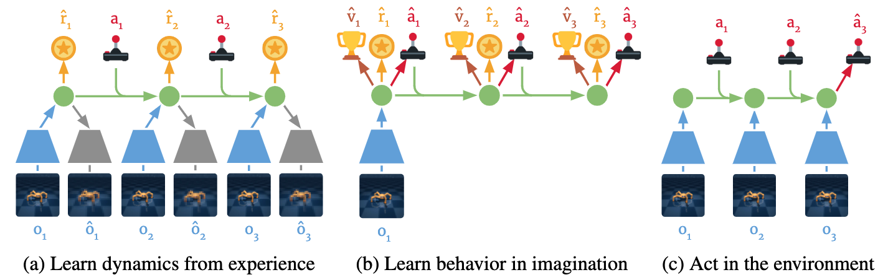

**Latent World Model**  
1. **Encoder** \(e_\phi(\mathbf{o}_t)\) compresses raw observation \(\mathbf{o}_t\) into a latent state \(\mathbf{z}_t\).  
2. **Recurrent Transition** \(p_\theta(\mathbf{z}_{t+1}\mid \mathbf{z}_t, a_t)\) predicts the next latent, plus a reward model \(\hat{r}_\theta(\mathbf{z}_t,a_t)\).  
3. **Decoder** \(d_\phi(\mathbf{z}_t)\) (optional) can reconstruct \(\mathbf{o}_t\) for training, but not necessarily used at inference.

**Policy Learning in Imagination**  
- An actor \(\pi_\psi(a_t\mid \mathbf{z}_t)\) and critic \(V_\psi(\mathbf{z}_t)\) are learned by **backprop through the latent rollouts**:

$$
   \max_{\psi} \;\; \mathbb{E}_{\substack{\mathbf{z}_0 \sim q(\mathbf{z}_0|\mathbf{o}_0) \\ a_t \sim \pi_\psi(\cdot|\mathbf{z}_t) \\ \mathbf{z}_{t+1} \sim p_\theta(\cdot|\mathbf{z}_t,a_t)}}\!\biggl[\sum_{t=0}^{H-1} \gamma^t \hat{r}_\theta(\mathbf{z}_t, a_t)\biggr].
$$

- Dreamer uses advanced techniques (e.g., **reparameterization**, **actor-critic with value expansion**, etc.) to stabilize training.

**Highlights**  
- **DreamerV1**: SOTA results on DM Control from image inputs.  
- **DreamerV2**: Extended to Atari, surpassing DQN with a single architecture.  
- **DreamerV3**: Achieved multi-domain generality (Atari, ProcGen, DM Control, robotics, Minecraft). The first algorithm to solve “collect a diamond” in Minecraft from scratch without demonstrations.

**Significance**  
- Demonstrates that purely **learning a latent world model** + **training by imagination** can match or surpass leading model-free methods in terms of both sample efficiency and final returns.

---

### 7.5 MuZero (DeepMind, 2020)

**Core Idea**  
Combines **Monte Carlo Tree Search (MCTS)** with a **learned latent state** to achieve superhuman performance on Go, Chess, Shogi, and set records on Atari—without knowing the environment’s rules explicitly.

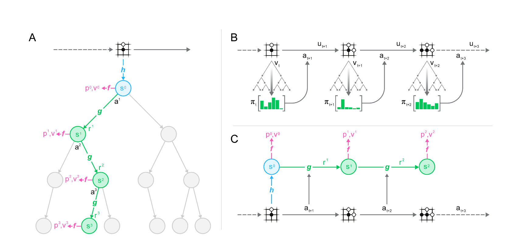

**Network Architecture**  
1. **Representation Function** \(h\):  
   - Maps the observation history to a latent state \(s_0 = h(\mathbf{o}_{1:t})\).  
2. **Dynamics Function** \(g\):  
   - Predicts the next latent state \(s_{k+1}=g(s_k, a_k)\) and immediate reward \(r_k\).  
3. **Prediction Function** \(f\):  
   - From a latent state \(s_k\), outputs a **policy** \(\pi_k\) (action logits) and a **value** \(v_k\).

**MCTS in Latent Space**  
- Starting from \(s_0\), expand a search tree by simulating actions via \(g\).  
- Each node stores mean value estimates \(\hat{V}\), visit counts, etc.  
- The final search policy \(\alpha\) is used to update the network (target policy), and the environment reward is used to refine the reward/dynamics parameters.

**Key Equations**  
- MuZero is trained to **minimize errors** in reward, value, and policy predictions:

$$
   \mathcal{L}(\theta) = \sum_{t=1}^{T} \bigl(\ell_\mathrm{value}(v_\theta(s_t), z_t) + \ell_\mathrm{policy}(\pi_\theta(s_t), \pi_t) + \ell_\mathrm{dyn}\bigl(g_\theta(s_t, a_t), s_{t+1}\bigr)\bigr),
$$

  with \(\pi_t\) and \(z_t\) from the improved MCTS-based targets.

**Achievements**  
- Matches **AlphaZero** performance on Go, Chess, Shogi, but **without** an explicit rules model.  
- Set new records on **Atari-57**.  
- Demonstrates that an **end-to-end learned model** can be as effective for MCTS as a known simulator, provided it is trained to be “value-equivalent” (predict future rewards and values accurately).

**Impact**  
- Showed that **“learning to model the environment’s reward and value structure is enough”**—MuZero does not need pixel-perfect next-state reconstructions.  
- Successfully extended MCTS-based planning to domains with unknown or complex dynamics.


---

## 8. Key Benefits (and Drawbacks) of MBRL

### 8.1 Data Efficiency

MBRL can yield higher sample efficiency:
- Simulating transitions in the model extracts more learning signal from each real step  
- E.g., PETS, MBPO, Dreamer require fewer environment interactions than top model-free methods

---

### 8.2 Exploration

A learned **uncertainty-aware** model can direct exploration to uncertain states:
- Bayesian or ensemble-based MBRL  
- Potentially more efficient than naive \(\epsilon\)-greedy in high dimensions

---

### 8.3 Optimality

With a perfect model, MBRL can find better or equal policies vs. model-free. But if the model is imperfect, compounding errors can lead to suboptimal solutions. Research aims to close that gap (MBPO, Dreamer, MuZero).

---

### 8.4 Transfer

A global **dynamics model** can be re-used across tasks or reward functions:
- E.g., a learned robotic physics model can quickly adapt to new goals
- Saves extensive retraining

---

### 8.5 Safety

In real-world tasks (robotics, healthcare), we can plan or verify constraints inside the model before acting. Uncertainty estimation is crucial.

---

### 8.6 Explainability

A learned model can sometimes be probed or visualized, offering partial interpretability (though deep generative models remain somewhat opaque).

---

### 8.7 Disbenefits

1. **Model bias**: Imperfect models => compounding errors  
2. **Computational overhead**: Planning can be expensive  
3. **Implementation complexity**: We must keep models accurate, stable, and do policy updates in tandem

---

## 9. Conclusion

Model-Based RL integrates **planning** and **learning** in the RL framework, offering strong sample efficiency and structured decision-making. Algorithms like **MBPO**, **Dreamer**, and **MuZero** demonstrate that short rollouts, uncertainty estimates, or latent value-equivalent models can yield high final performance with fewer real samples.

Still, challenges remain:
- Robustness under partial observability, stochastic transitions, or non-stationary tasks  
- Balancing planning vs. data collection adaptively  
- Scaling to high-dimensional, real-world tasks with safety constraints

Future work includes deeper hierarchical methods, advanced uncertainty modeling, bridging theory and practice, and constructing more interpretable or structured models.

---

## 10. Author(s)

<div class="grid cards" markdown>
-   {align=left width="150"}
    <span class="description">
        <p>**Naser Kazemi**</p>
        <p>Teaching Assistant</p>
        <p>[naserkazemi2002@gmail.com](mailto:naserkazemi2002@gmail.com)</p>
        <p>
        [:fontawesome-brands-github:](https://github.com/naser-kazemi){:target="_blank"}
        </p>
    </span>
</div>

## 11. References

- **S. Levine (CS 294-112: Deep RL)**  
  *Model-Based Reinforcement Learning, Lecture 9 slides.*  
  [Lecture Site](https://rail.eecs.berkeley.edu/deeprlcourse/), [Video Repository](https://www.youtube.com/playlist?list=PLwRJQ4m4UJjOv1QCr2f1XDNRWGM4un3—)  
  **Additional resources**: [Open course materials from UC Berkeley’s Deep RL class](http://rail.eecs.berkeley.edu/deeprlcourse/)  

- **T. Moerland et al. (2022)**  
  *“Model-based Reinforcement Learning: A Survey.”* [arXiv:2006.16712v4](https://arxiv.org/abs/2006.16712)  
  **Additional resources**: [Official GitHub for references and code snippets mentioned in the paper](https://github.com/tmoer/mbrl-survey)  

- **Sutton, R.S. & Barto, A.G.**  
  *Reinforcement Learning: An Introduction (2nd edition).* MIT Press, 2018.  
  [Online Draft](http://incompleteideas.net/book/the-book-2nd.html)  
  **Additional resources**: [Exercise solutions and discussion forum](https://www.reddit.com/r/reinforcementlearning/)  

- **Puterman, M.L.**  
  *Markov Decision Processes: Discrete Stochastic Dynamic Programming.* John Wiley & Sons, 2014.  
  [Publisher Link](https://www.wiley.com/en-us/Markov+Decision+Processes%3A+Discrete+Stochastic+Dynamic+Programming-p-9780471727828)  
  **Additional resources**: [Various lecture slides summarizing MDP fundamentals](https://www2.isye.gatech.edu/~harahang.course/6231/MDPnotes.pdf)  

- **Deisenroth, M. & Rasmussen, C.E.** (2011)  
  *PILCO: A Model-Based and Data-Efficient Approach to Policy Search.* ICML.  
  [Paper PDF](https://proceedings.mlr.press/v15/deisenroth11a/deisenroth11a.pdf)  
  **Additional resources**: [Official code release on GitHub](https://github.com/mwhoffman/pilco)  

- **Chua, K. et al.** (2018)  
  *“Deep Reinforcement Learning in a Handful of Trials using Probabilistic Dynamics Models (PETS).”* NeurIPS.  
  [Paper Link](https://proceedings.neurips.cc/paper_files/paper/2018/file/3de568f8597b94bda53149c7d7f5958c-Paper.pdf)  
  **Additional resources**: [Author’s implementation](https://github.com/kchua/handful-of-trials)  

- **Janner, M. et al.** (2019)  
  *“When to Trust Your Model: Model-Based Policy Optimization.”* NeurIPS (MBPO).  
  [Paper Link](https://proceedings.neurips.cc/paper_files/paper/2019/file/5faf461eff3099671ad63c6f3f094f7f-Paper.pdf)  
  **Additional resources**: [Berkeley AI Research blog post](https://bair.berkeley.edu/blog/2019/12/12/mbpo/)  

- **Hafner, D. et al.** (2020–2023)  
  *“Dreamer” line of papers* (ICML, arXiv).  
  [DreamerV2 Code](https://github.com/danijar/dreamer), [Dreamer Blog](https://danijar.com/dreamer/)  
  **Additional resources**: [Tutorial videos by Danijar Hafner on latent world models](https://danijar.com/)  

- **Ha, D. & Schmidhuber, J.** (2018)  
  *“World Models.”* NeurIPS.  
  [Paper PDF](https://proceedings.neurips.cc/paper/2018/file/2de5d16682c3c35007e4e92982f1a2ba-Paper.pdf), [Project Site](https://worldmodels.github.io/)  
  **Additional resources**: [Interactive demos and blog articles from David Ha](https://otoro.net/)  

- **Silver, D. et al.** (various)  
  *AlphaGo, AlphaZero, MuZero* lines of research.  
  [DeepMind’s MuZero Blog](https://deepmind.com/blog/article/muzero-mastering-go-chess-shogi-and-atari)  
  **Additional resources**: [Further reading on MCTS, AlphaGo, and AlphaZero in “Mastering the Game of Go” series](https://www.nature.com/articles/nature16961)  