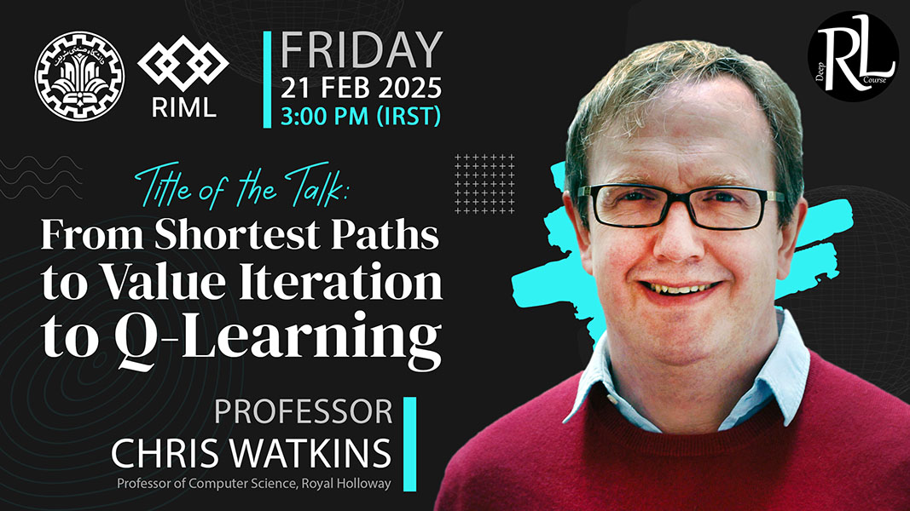

# Chris Watkins

### About

Professor Christopher Watkins is a world-class authority on reinforcement learning and evolutionary theory. He is a Professor of Machine Learning at the Department of Computer Science, Royal Holloway, University of London. Renowned for his foundational contributions to artificial intelligence, Professor Watkins introduced the Q-learning algorithm, a pivotal breakthrough that laid the groundwork for modern reinforcement learning. [Read more](https://www.cs.rhul.ac.uk/~chrisw/){:target="_blank"}

[Sign Up for the Talk](https://forms.gle/ET3Y5jB6Jt9vkQ2x9){:target="_blank" .md-button .md-button--primary }