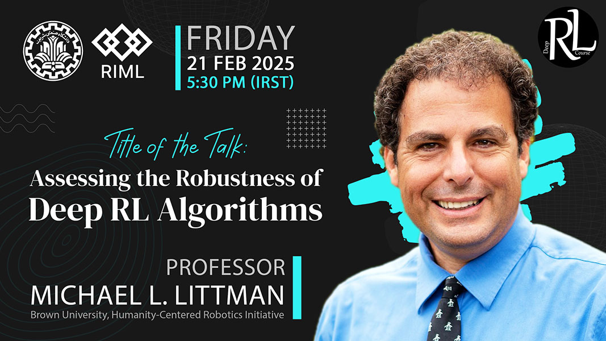

# Michael Littman

### About

Michael L. Littman is a University Professor of Computer Science at Brown University, studying machine learning and decision making under uncertainty. He has earned multiple university-level awards for teaching and his research on reinforcement learning, probabilistic planning, and automated crossword-puzzle solving has been recognized with three best-paper awards and three influential paper awards. Littman is co-director of Brown's Humanity Centered Robotics Initiative and a Fellow of the Association for the Advancement of Artificial Intelligence and the Association for Computing Machinery. He is also a Fellow of the American Association for the Advancement of Science Leshner Leadership Institute for Public Engagement with Science, focusing on Artificial Intelligence. [Read more](https://www.littmania.com/){:target="_blank"}

[Sign Up for the Talk](https://forms.gle/amgtsGrDVn4mdRai9){:target="_blank" .md-button .md-button--primary }