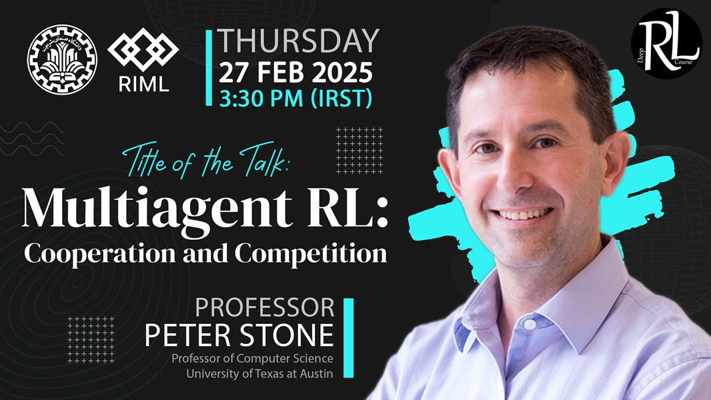

# Peter Stone

### About

Peter Stone is an American computer scientist who holds the Truchard Foundation Chair of Computer Science at The University of Texas at Austin. He is also Chief Scientist of Sony AI, an Alfred P. Sloan Research Fellow, Guggenheim Fellow, AAAI Fellow, IEEE Fellow, AAAS Fellow, ACM Fellow, and Fulbright Scholar. [Read more](https://en.wikipedia.org/wiki/Peter_Stone_(professor)){:target="_blank"}

[Sign Up for the Talk](https://forms.gle/M4QxTUWimGyvUmPv7){:target="_blank" .md-button .md-button--primary }