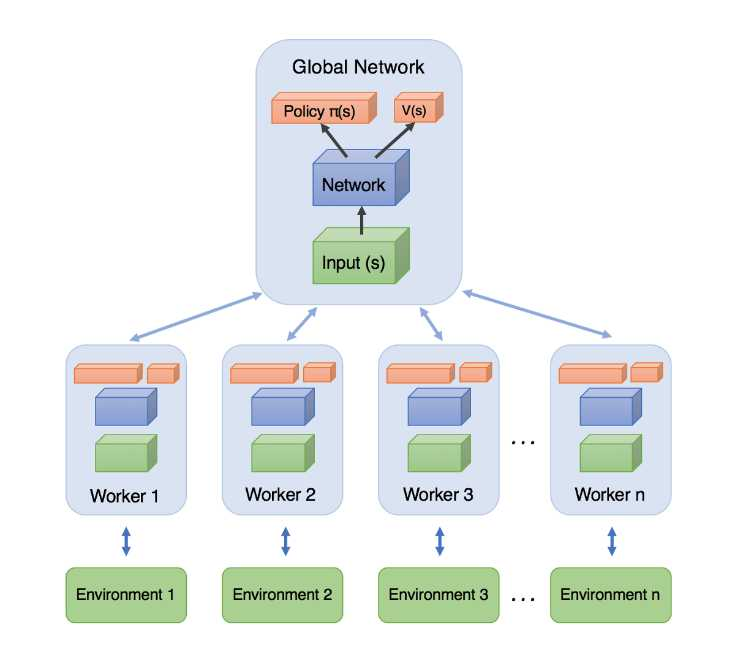
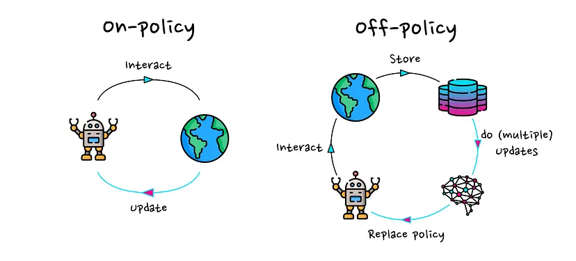
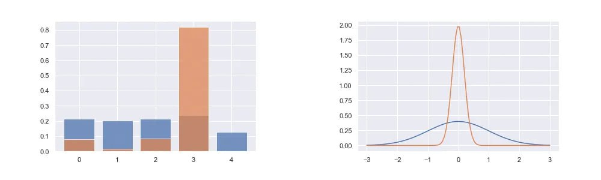

# Week 4: Advanced Methods	

### Screen Record

<iframe width="996" height="560" src="https://www.youtube.com/embed/BHc02uFaPxk" title="YouTube video player" frameborder="0" allow="accelerometer; autoplay; clipboard-write; encrypted-media; gyroscope; picture-in-picture; web-share" referrerpolicy="strict-origin-when-cross-origin" allowfullscreen></iframe>

---

### Recitation Notes

#### Actor_Critic

The variance of policymethods can originate from two sources:
1. high variance in the cumulative reward estimate and 
2. high variance in the gradient estimate. 

For both problems, a solution has been developed: bootstrapping for better reward estimates and baseline subtraction to lower the variance of gradient estimates.

In the next seciton we will review the concepts bootstrapping (***reward to go***), using baseline (***Advantage value***) and ***Generalized Advantage Estimation*** (GAE).

##### Reward to Go:
***A cumulative reward from state $s_t$ to the end of the episode by applying policy $\pi_\theta$.***

As mentioned earlier, in the *policy gradient* method, we update our policy weights with the learning rate $\alpha$ as follows:

$$
\theta \leftarrow \theta + \alpha \nabla_\theta J(\theta),
$$

where

$$
\nabla_\theta J(\theta) \approx \frac{1}{N} \sum^N_{i=1} \sum^T_{t=1} \nabla_\theta \log\pi_\theta(a_{i,t}|s_{i,t})\cdot r(s_{i,t},a_{i,t}).
$$

In this equation, the term $r(s_{i,t}, a_{i,t})$ is the primary source of variance and noise. We use the *causality trick* to mitigate this issue by multiplying the policy gradient at state $s_t$ with its future rewards. It is important to note that the policy at state $s_t$ can only affect future rewards, not past ones. The causality trick is represented as follows:

$$
\nabla_\theta J(\theta) \approx \frac{1}{N} \sum^N_{i=1}\bigg( \sum^T_{t=1} \nabla_\theta \log\pi_\theta(a_{i,t}|s_{i,t})\bigg) \bigg( \sum^T_{t=1}r(s_{i,t},a_{i,t}) \bigg) \approx \frac{1}{N} \sum^N_{i=1} \sum^T_{t=1} \nabla_\theta \log\pi_\theta(a_{i,t}|s_{i,t})\bigg( \sum^T_{t'=t}r(s_{i,t'},a_{i,t'}) \bigg).
$$

The term $\sum^T_{t'=t}r(s_{i,t'},a_{i,t'})$ is known as ***reward to go***, which is calculated in a Monte Carlo manner. It represents the total expected reward from a given state by applying policy $\pi_\theta$, starting from time $t$ to the end of the episode.

To further reduce variance, we can approximate the *reward to go* with the *Q-value*, which conveys a similar meaning. Thus, we can rewrite $\nabla_\theta J(\theta)$ as:

$$
\nabla_\theta J(\theta) \approx \frac{1}{N} \sum^N_{i=1} \sum^T_{t=1} \nabla_\theta \log\pi_\theta(a_{i,t}|s_{i,t}) Q(s_{i,t},a_{i,t}).
$$

##### Advantage Value:
***Measures how much an action is better than the average of other actions in a given state.***

###### Why Use the Advantage Value?
We can further reduce variance by subtracting a baseline from $Q(s_{i,t}, a_{i,t})$ without altering the expectation of $\nabla_\theta J(\theta)$, making it an unbiased estimator:

$$
\nabla_\theta J(\theta) \approx \frac{1}{N} \sum^N_{i=1} \sum^T_{t=1} \nabla_\theta \log\pi_\theta(a_{i,t}|s_{i,t}) \bigg( Q(s_{i,t},a_{i,t}) - b_t \bigg).
$$

A reasonable choice for the baseline is the expected reward. Although it is not optimal, it significantly reduces variance.

We define:

$$
Q(s_{i,t},a_{i,t}) = \sum_{t'=t}^T E_{\pi_\theta}[r(s_{t'}, a_{t'})|s_t,a_t].
$$

To ensure the baseline is independent of the action taken, we compute the expectation of $Q(s_{i,t}, a_{i,t})$ over all actions sampled from the policy:

$$
E_{a_t \sim \pi_\theta(a_{i,t}|s_{i,t})} [Q(s_{i,t},a_{i,t})] = V(s_t) = b_t.
$$

Thus, the variance-reduced policy gradient equation becomes:

$$
\nabla_\theta J(\theta) \approx \frac{1}{N} \sum^N_{i=1} \sum^T_{t=1} \nabla_\theta \log\pi_\theta(a_{i,t}|s_{i,t}) \bigg( Q(s_{i,t},a_{i,t}) - V(s_t) \bigg).
$$

We define the *advantage function* as:

$$
A(s_t,a_t) = Q(s_{i,t},a_{i,t}) - V(s_t).
$$

###### Understanding the Advantage Function

Consider a penalty shootout game to illustrate the concept of the advantage function and Q-values in reinforcement learning.

####### Game Setup:
- A goalie always jumps to the right to block the shot.
- A kicker can shoot either left or right with equal probability (0.5 each), defining the kicker's policy $\pi_k$.

The reward matrix for the game is:

| Kicker / Goalie | Right (jumps right) | Left (jumps left) |
|:---:|:---:|:---:|
| Right (shoots right)  | 0,1  | 1,0  |
| Left (shoots left)    | 1,0  | 0,1  |

####### Expected Reward:
Since the kicker selects left and right with equal probability, the expected reward is:

$$
V^{\pi_k}(s_t) = 0.5 \times 1 + 0.5 \times 0 = 0.5.
$$

####### Q-Value Calculation:
The Q-value is expressed as:

$$
Q^{\pi_k}(s_{i,t},a_{i,t}) = V^{\pi_k}(s_t) + A^{\pi_k}(s_t,a_t).
$$

- If the kicker shoots right, the shot is always saved ($Q^{\pi_k}(s_{i,t},r) = 0$).
- If the kicker shoots left, the shot is always successful ($Q^{\pi_k}(s_{i,t},l) = 1$).

####### Advantage Calculation:
The advantage function $A^{\pi_k}(s_t,a_t)$ measures how much better or worse an action is compared to the expected reward.

- If the kicker shoots left, he scores (reward = 1), which is 0.5 more than the expected reward $V^{\pi_k}(s_t)$. Thus, the advantage of shooting left is:

$$
1 = 0.5 + A^{\pi_k}(s_t,l) \Rightarrow A^{\pi_k}(s_t,l) = 0.5.
$$

- If the kicker shoots right, he fails (reward = 0), which is 0.5 less than the expected reward. Thus, the advantage of shooting right is:

$$
0 = 0.5 + A^{\pi_k}(s_t,r) \Rightarrow A^{\pi_k}(s_t,r) = -0.5.
$$

###### Estimating the Advantage Value

Instead of maintaining separate networks for estimating $V(s_t)$ and $Q(s_{i,t}, a_{i,t})$, we approximate $Q(s_{i,t}, a_{i,t})$ using $V(s_t)$:

$$
Q(s_{i,t},a_{i,t}) = r(s_t, a_t) + \sum_{t'=t+1}^T E_{\pi_\theta}[r(s_{t'}, a_{t'})|s_t,a_t] \approx r(s_t, a_t) + V(s_{t+1}).
$$

Thus, we estimate the advantage function as:

$$
A(s_{i,t},a_{i,t}) \approx r(s_t, a_t) + V(s_{t+1}) - V(s_t).
$$

We can also, consider the advantage function with discount factor as:

$$
A(s_{i,t},a_{i,t}) \approx r(s_t, a_t) + \gamma V(s_{t+1}) - V(s_t).
$$

To train the value estimator, we use Monte Carlo estimation.

##### Generalized Advantage Estimation (GAE)
To have a good  balance between variance and bias, we can use the concept of GAE, which is firstly introduced in [High-Dimensional Continuous Control Using Generalized Advantage Estimation](https://arxiv.org/abs/1506.02438). 

At the first, we define $\hat{A}^{(k)}(s_{i,t},a_{i,t})$ to understand this the GAE concept.

$$
\hat{A}^{(k)}(s_{i,t},a_{i,t}) = r(s_t, a_t) + \dots + \gamma^{k-1}r(s_{t+k-1}, a_{t+k-1}) + \gamma^k V(s_{t+k})- V(s_t).
$$

So, we can write the $\hat{A}^{(k)}(s_{i,t},a_{i,t})$ for $k \in \{1, \infty\}$ as:

$$
\hat{A}^{(1)}(s_{i,t},a_{i,t}) = r(s_t, a_t) + \gamma V(s_{t+1}) - V(s_t)
$$

$$
\hat{A}^{(2)}(s_{i,t},a_{i,t}) = r(s_t, a_t) + \gamma r(s_{t+1}, a_{t+1}) + \gamma^2 V(s_{t+2}) - V(s_t)
$$

$$
.\\
.\\
.\\
$$

$$
\hat{A}^{(\infty)}(s_{i,t},a_{i,t}) = r(s_t, a_t) + \gamma r(s_{t+1}, a_{t+1}) + \gamma^2 r(s_{t+2}, a_{t+2})+ \dots - V(s_t)\\
$$

$\hat{A}^{(1)}(s_{i,t},a_{i,t})$ is high bias, low variance, whilst $\hat{A}^{(\infty)}(s_{i,t},a_{i,t})$ is unbiased, high variance.

We take a weighted average of all $\hat{A}^{(k)}(s_{i,t},a_{i,t})$ for $k \in \{1, \infty\}$ with weight $w_k = \lambda^{k-1}$ to balance bias and variance. This is called Generalized Advantage Estimation (GAE). 

$$
\hat{A}^{(GAE)}(s_{i,t},a_{i,t}) = \frac{\sum_{k =1}^T  w_k \hat{A}^{(k)}(s_{i,t},a_{i,t})}{\sum_k w_k}= \frac{\sum_{k =1}^T \lambda^{k-1} \hat{A}^{(k)}(s_{i,t},a_{i,t})}{\sum_k w_k}
$$

##### Actor_Critic Algorihtms

###### Batch actor-critic algorithm
The first algorithm is: *Actor-Critic with Bootstrapping and Baseline Subtraction*
In this algorithm, the simulator runs for an entire episode before updating the policy.

**Batch actor-critic algorithm:**

1. **for** each episode **do**:
2. &emsp;**for** each step **do**:
3. &emsp;&emsp;Take action $a_t \sim \pi_{\theta}(a_t | s_t)$, get $(s_t,a_t,s'_t,r_t)$.
4. &emsp;Fit $\hat{V}(s_t)$ with sampled rewards.
5. &emsp;Evaluate the advantage function: $A({s_t, a_t})$
6. &emsp;Compute the policy gradient: $\nabla_{\theta} J(\theta) \approx \sum_{i} \nabla_{\theta} \log \pi_{\theta}(a_i | s_i) A({s_t})$
7. &emsp;Update the policy parameters:  $\theta \gets \theta + \alpha \nabla_{\theta} J(\theta)$
 

Running full episodes for a single update is inefficient as it requires a significant amount of time. To address this issue, the o**online actor-critic algorithm** is proposed.

###### Online actor-critic algorithm

In this algorithm, we take an action in the environment and immediately apply an update using that action.

**Online actor-critic algorithm**

1. **for** each episode **do**:
2. &emsp;**for** each step **do**:
3. &emsp;&emsp;Take action $a_t \sim \pi_{\theta}(a_t | s_t)$, get $(s_t,a_t,s'_t,r_t)$.
2. &emsp;&emsp;Fit $\hat{V}(s_t)$ with the sampled reward.
3. &emsp;&emsp;Evaluate the advantage function: $A({s,a})$
4. &emsp;&emsp;Compute the policy gradient: $\nabla_{\theta} J(\theta) \approx  \nabla_{\theta} \log \pi_{\theta}(a | s) A({s,a})$
5. &emsp;&emsp;Update the policy parameters: $\theta \gets \theta + \alpha \nabla_{\theta} J(\theta)$

Training neural networks with a batch size of 1 leads to high variance, making the training process unstable.

To mitigate this issue, two main solutions are commonly used:
1. **Parallel Actor-Critic (Online)**
2. **Off-Policy Actor-Critic**

###### Parallel Actor-Critic (Online)
Many high-performance implementations are based on the actor critic approach. For large problems, the algorithm is typically parallelized and implemented on a large cluster computer.

To reduce variance, multiple actors are used to update the policy. There are two main approaches:

- **Synchronized Parallel Actor-Critic:** All actors run synchronously, and updates are applied simultaneously. However, this introduces synchronization overhead, making it impractical in many cases.
- **Asynchronous Parallel Actor-Critic:** Each actor applies its updates independently, reducing synchronization constraints and improving computational efficiency. It also, uses asynchronous (parallel and distributed) gradient descent for optimization of deep neural network controllers.

###### Off-Policy Actor-Critic Algorithm

In the off-policy approach, we maintain a replay buffer to store past experiences, allowing us to train the model using previously collected data rather than relying solely on the most recent experience.

offpolicy.png

**Off-policy actor-critic algorithm:**

1. **for** each episode **do**:
1. &emsp;**for** multiple steps **do**:
1. &emsp;&emsp;Take action $a \sim \pi_{\theta}(a | s)$, get $(s,a,s',r)$, store in $\mathcal{R}$.
2. &emsp;Sample a batch $\{s_i, a_i, r_i, s'_i \}$ for buffer $\mathcal{R}$.
3. &emsp;Fit $\hat{Q}^{\pi}(s_i, a_i)$ for each $s_i, a_i$.
4. &emsp;Compute the policy gradient: $\nabla_{\theta} J(\theta) \approx \frac{1}{N} \sum_{i} \nabla_{\theta} \log \pi_{\theta}(a^{\pi}_i | s_i) \hat{Q}^{\pi}(s_i, a^{\pi}_i)$
5. &emsp;Update the policy parameters: $\theta \gets \theta + \alpha \nabla_{\theta} J(\theta)$

To work with off-policy methods, we use the Q-value instead of the V-value in step 3. In step 4, rather than using the advantage function, we directly use $\hat{Q}^{\pi}(s_i, a^{\pi}_i)$, where $a^{\pi}_i$  is sampled from the policy $\pi$. By using the Q-value instead of the advantage function, we do not encounter the high-variance problem typically associated with single-step updates. This is because we sample a batch from the replay buffer, which inherently reduces variance. As a result, there is no need to compute an explicit advantage function for variance reduction.

##### Issues with Standard Policy Gradient Methods
Earlier policy gradient methods, such as Vanilla Policy Gradient (VPG) or REINFORCE, suffer from high variance and instability in training. A key problem is that large updates to the policy can lead to drastic performance degradation.

To address these issues, Trust Region Policy Optimization (TRPO) was introduced, enforcing a constraint on how much the policy can change in a single update. However, TRPO is computationally expensive because it requires solving a constrained optimization problem.
PPO is a simpler and more efficient alternative to TRPO, designed to ensure stable policy updates without requiring complex constraints.

---

#### Proximal Policy Optimization (PPO)

##### The intuition behind PPO
The idea with Proximal Policy Optimization (PPO) is that we want to improve the training stability of the policy by limiting the change you make to the policy at each training epoch: **we want to avoid having too large policy updates**.  why?

1. We know empirically that smaller policy updates during training are more likely to converge to an optimal solution.
2. If we change the policy too much, we may end up with a bad policy that cannot be improved.

Therefore, in order not to allow the current policy to change much compared to the previous policy, we limit the ratio of these two policies to  $[1 - \epsilon, 1 + \epsilon]$.

##### the Clipped Surrogate Objective 
$$
L^{CLIP}(\theta) = \hat{\mathbb{E}}_t \left[ \min \left( r_t(\theta) \hat{A}_t, \text{clip} \left( r_t(\theta), 1 - \epsilon, 1 + \epsilon \right) \hat{A}_t \right) \right]
$$

###### The ratio Function
$$
r_t(\theta) = \frac{\pi_{\theta}(a_t | s_t)}{\pi_{\theta_{\text{old}}}(a_t | s_t)}
$$

$r_{\theta}$ denotes the probability ratio between the current and old policy. if $r_{\theta} > 1$, then the probability of doing action $a_t$ at $s_t$ in current policy is higher than the old policy and vice versa.

So this probability ratio is an easy way to estimate the divergence between old and current policy.

###### The clipped part
$$
\text{clip} \left( r_t(\theta), 1 - \epsilon, 1 + \epsilon \right) \hat{A}_t
$$

If the current policy is updated significantly, such that the new policy parameters $\theta'$  diverge greatly from the previous ones, the probability ratio between the new and old policies is clipped to the bounds 
$1 - \epsilon$, $1 + \epsilon$. At this point, the derivative of the objective function becomes zero, effectively preventing further updates. 

###### The unclipped part
$$
r_t(\theta) \hat{A}_t
$$

In the context of optimization, if the initial starting point is not ideal—i.e., if the probability ratio between the new and old policies is outside the range of $1 - \epsilon$ and $1 + \epsilon$—the ratio is clipped to these bounds. This clipping results in the derivative of the objective function becoming zero, meaning no gradient is available for updates. 

In this formulation, the optimization is performed with respect to the new policy parameters $\theta'$, and $A$ represents the advantage function, which indicates how much better or worse the action performed is compared to the average return.

- Case 1: Positive Advantage

if the Advantage $A$ is positive (indicating that the action taken has a higher return than the expected return), and $\frac{\pi_{\theta}(a_t | s_t)}{\pi_{\theta_{\text{old}}}(a_t | s_t)} < 1-\epsilon$ , the unclipped part is less than the clipped part and then it is minimized, so we have gradient to update the policy. This allows the policy to increase the probability of the action, aiming for the ratio to reach $1 + \epsilon$ without violating the clipping constraint.

- Case 2: Negative Advantage

On the other hand, if the Advantage $A$ is negative (meaning the action taken is worse than the average return), and $\frac{\pi_{\theta}(a_t | s_t)}{\pi_{\theta_{\text{old}}}(a_t | s_t)} > 1+\epsilon$, the unclipped objective is again minimized and the gradient is non-zero, leading to an update. In this case, since the Advantage is negative, the policy is adjusted to reduce the probability of selecting that action, bringing the ratio closer to the boundary ($1-\epsilon$), while ensuring that the new policy does not deviate too much from the old one.

The below figure shows 

###### Visualize the Clipped Surrogate Objective

##### PPO pseudocode

**Algorithm PPO-Clip**

1. Input: initial policy parameters $\theta_0$, initial value function parameters $\phi_0$  
2. **for** $k = 0, 1, 2, \dots$ **do**  
3. &emsp; Collect set of trajectories $\mathcal{D}_k = \{\tau_i\}$ by running policy $\pi_k = \pi(\theta_k)$ in the environment.  
4. &emsp; Compute rewards-to-go $\hat{R}_t$.  
5. &emsp; Compute advantage estimates, $\hat{A}_t$ (using any method of advantage estimation) based on the current value function $V_{\phi_k}$.  

6. &emsp; Update the policy by maximizing the PPO-Clip objective (typically via stochastic gradient ascent with Adam): 

    $$\theta_{k+1} = \arg \max_{\theta} \frac{1}{|\mathcal{D}_k| T} \sum_{\tau \in \mathcal{D}_k} \sum_{t=0}^{T} \min \left( \frac{\pi_{\theta}(a_t | s_t)}{\pi_{\theta_k}(a_t | s_t)} A^{\pi_{\theta_k}}(s_t, a_t), \, g(\epsilon, A^{\pi_{\theta_k}}(s_t, a_t)) \right)$$

7. &emsp; Fit value function by regression on mean-squared error (typically via some gradient descent algorithm):  

    $$\phi_{k+1} = \arg \min_{\phi} \frac{1}{|\mathcal{D}_k| T} \sum_{\tau \in \mathcal{D}_k} \sum_{t=0}^{T} \left( V_{\phi}(s_t) - \hat{R}_t \right)^2$$

8. **end for**

---

##### Cons of PPO algorithm
 PPO requires a significant amount of interactions with the environment to converge. This can be problematic in real-world applications where data is expensive or difficult to collect. in fact it is a sample inefficient algorithm.

##### Helpful links

- [Unit 8, of the Deep Reinforcement Learning Class with Hugging Face](https://huggingface.co/blog/deep-rl-ppo)
- [Proximal Policy Optimization (PPO) Explained](https://towardsdatascience.com/proximal-policy-optimization-ppo-explained-abed1952457b)
- [Proximal Policy Optimization (PPO) - How to train Large Language Models](https://www.youtube.com/watch?v=TjHH_--7l8g)

---

#### Deep Deterministic Policy Gradient (DDPG)  

#####  Overview
- DDPG is an off-policy, model-free algorithm for continuous action spaces.  
- Uses **actor-critic architecture** with deterministic policy gradients.  

##### DDPG Algorithm 
- **Actor network** outputs deterministic actions.  
- **Critic network** evaluates action-value (Q-function).  
- **Target networks** and **soft updates** improve stability.  
- **Exploration via Ornstein-Uhlenbeck noise**.  

##### Key Components
- **Replay Buffer**: Stores experience for efficient learning.  
- **Target Networks**: Helps reduce overestimation bias.  

##### Pros and Cons
**Pros:** Works well for high-dimensional continuous control, sample efficient.  
**Cons:** Prone to overestimation bias, sensitive to hyperparameters.  

##### Helpful links

- [Reinforcement Learning - "DDPG" explained](https://www.youtube.com/watch?v=oydExwuuUCw)

---

#### Soft Actor-Critic (SAC) 

##### Challenges and motivation of SAC
1. Previous Off-policy methods like DDPG often struggle with exploration , leading to suboptimal policies. SAC overcomes this by introducing entropy maximization, which encourages the agent to explore more efficiently.
2. Sample inefficiency is a major issue in on-policy algorithms like Proximal Policy Optimization (PPO), which require a large number of interactions with the environment. SAC, being an off-policy algorithm, reuses past experiences stored in a replay buffer, making it significantly more sample-efficient.
3. Another challenge is instability in learning, as methods like DDPG and Twin Delayed Deep Deterministic Policy Gradient (TD3) can suffer from overestimation of Q-values. SAC mitigates this by employing twin Q-functions (similar to TD3) and incorporating entropy regularization, leading to more stable and robust learning.

In essence, SAC seeks to maximize the entropy in policy, in addition to the expected reward from the environment. The entropy in policy can be interpreted as randomness in the policy.

##### What is entropy?
We can think of entropy as how unpredictable a random variable is. If a random variable always takes a single value then it has zero entropy because it’s not unpredictable at all. If a random variable can be any Real Number with equal probability then it has very high entropy as it is very unpredictable.

*probability distributions with low entropy have a tendency to greedily sample certain values, as the probability mass is distributed relatively unevenly.*

- SAC is an off-policy algorithm that incorporates **entropy maximization** for better exploration.  
- Outperforms DDPG in sample efficiency and stability.  

##### Maximum Entropy Reinforcement Learning

In Maximum Entropy RL, the agent tries to optimise the policy to choose the right action that can receive the highest sum of reward and long term sum of entropy. This enables the agent to explore more and avoid converging to local optima.

**`reason`**: We want a high entropy in our policy to explicitly encourage exploration, to encourage the policy to assign equal probabilities to actions that have same or nearly equal Q-values(allow the policy to capture multiple modes of good policies), and also to ensure that it does not collapse into repeatedly selecting a particular action that could exploit some inconsistency in the approximated Q function. Therefore, SAC overcomes the  problem by encouraging the policy network to explore and not assign a very high probability to any one part of the range of actions.

The objective function of the Maximum entropy RL is as shown below:

$$J(\pi_{\theta}) = \mathbb{E}_{\pi_{\theta}} \left[ \sum_{t=0}^{\infty} \gamma^t R(s_t, a_t) + \alpha H(\pi(\cdot | s_t)) \right]$$

and the optimal policy is:

$$\pi^* = argmax_{\pi_{\theta}}\space\mathbb{E}_{\pi_{\theta}} \left[ \sum_{t=0}^{\infty} \gamma^t R(s_t, a_t) + \alpha H(\pi(\cdot | s_t)) \right]$$

**$\alpha$** is the temperature parameter that balances between exploration and exploitation.
 

##### Soft Policy

- Soft policy 

$$J(\pi) = \sum_{t=0}^{T} \mathbb{E}_{(s_t, a_t)\sim\rho_{\pi}} \left[ r(s_t, a_t) + \alpha\mathcal{H}(\pi(\cdot | s_t)) \right]$$

With new objective function we need to define Value funciton and Q-value funciton again. 

- Soft Q-value funciton

$$Q(s_t, a_t) = r(s_t, a_t) + \gamma\mathbb{E}_{s_{t+1}\sim p}\left[ V(s_{t+1}) \right]$$

- Soft Value function

$$V(s_t) = \mathbb{E}_{a_t\sim \pi} \left[Q(s_t, a_t) - \text{log}\space\pi(a_t|s_t)\right]$$

---

#### Comparison of PPO, DDPG, and SAC 
| Feature        | PPO | DDPG | SAC |
|---------------|-----|------|-----|
| Policy Type   | Stochastic | Deterministic | Stochastic |
| Environment Type | Discrete/Continuous | Continuous | Discrete/Continuous |
| Sample Efficiency | Medium | High | High |
| Exploration  | Implicit Clipping | Ornstein-Uhlenbeck Noise | Entropy Regularization |
| Stability    | High | Low | High |
| Computational Cost | Medium | Low | High |

---

#### Conclusion
- **PPO** is a stable, on-policy method suitable for both discrete and continuous action spaces.
- **DDPG** is efficient in continuous control but sensitive to hyperparameters.
- **SAC** improves upon DDPG with better exploration and stability.
- Choosing between these methods depends on the specific RL problem and computational constraints.

---

#### Author(s)

-   {align=left width="150"}
    
        
**Ahmad Karami**

        
Teaching Assistant

        
[ahmad.karami77@yahoo.com](mailto:ahmad.karami77@yahoo.com)

        

        [:fontawesome-brands-linkedin-in:](https://www.linkedin.com/in/ahmad-karami-8a6a14255){:target="_blank"}
        

    

